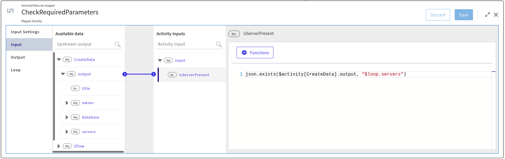
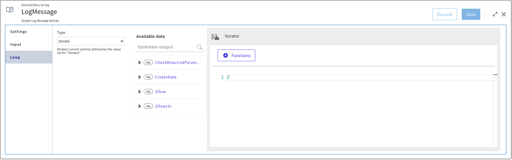
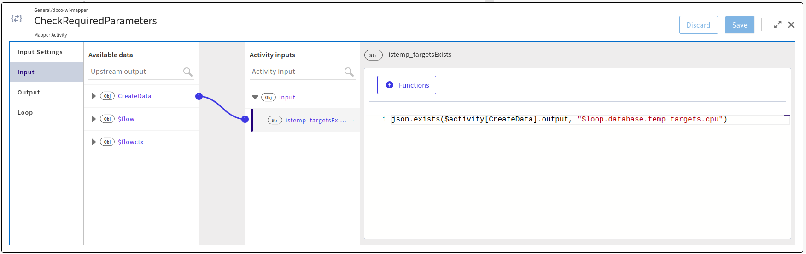
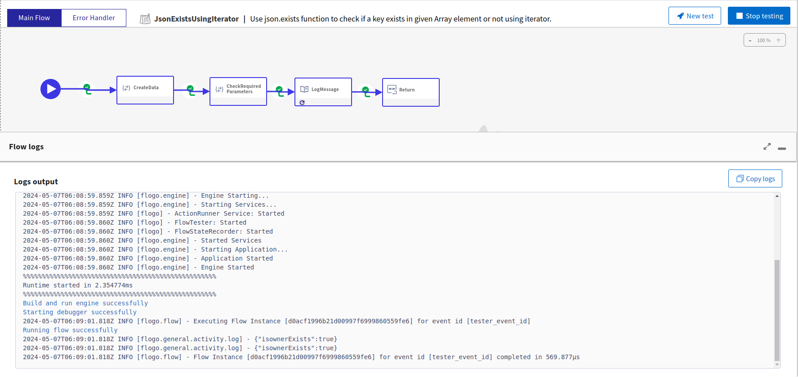

 # Function json.exists

## Prerequisites
TIBCO Cloud™ Integration - latest version. 

## Overview
This application will demonstrate you how quickly users can use/leverage the json.exists function to check if a key exists in given json object or not. The key can also be a JSONPath expression, the function should return true if the expression evaluates to true else false.

Here, we’re demonstrating 3 different ways to use json.exists function like,

1. JSON.exits function: Array inside Object
Use json.exists function to check if a key exists in given Array element or not. If key exists it will return ture else false.

2. JSON.exits function: using Itertor
Use json.exists function to check if a key exists in given Array element or not using iterato. If key exists it will return ture else false.

3. JSON.exits function: using Nested object
Use json.exists function to check if a key exists in given Nested Array or not. If key exists it will return ture else false.

## Steps to use the Flogo application: 
1. Download the Flogo application (JSON file) from [here](../../../app-dev/Mapping-Arrays/jsonExists/JSONExistsFunction.json).
2. Login to TIBCO Cloud™ Integration with a valid subscription.
3. Steps to import the Flogo application (from step #1) is listed [here](https://github.com/TIBCOSoftware/tci-flogo/blob/master/samples/app-dev/readme.md).
4. The imported Flogo app should look like shown below.!(../../app-dev/import-screenshots/JSONExit/JSONExists.png)
For any additional information, please raise your queries or issues via the Issues section.

### Run the application
Once you are ready to run the application, you can use Push option and later run this app.
Once it reaches to Running state, go to Logs tab and check the results. 

If you want to test the sample in the Flow tester, click on the flow which you want to run, hit 'Test' button on top right corner and create a new launch configuration. Flow does not require any flow inputs. Click Next and Run button.

## Outputs

1. JSON.exits function: Array inside Object

2. JSON.exits function: using Itertor

3. JSON.exits function: using Nested object

## Contributing
If you want to build your own activities for Flogo please read the docs here.

If you want to showcase your project, check out [tci-awesome](https://github.com/TIBCOSoftware/tci-awesome)

You can also send an email to `tci@tibco.com`

## Feedback
If you have feedback, don't hesitate to talk to us!

* Submit feature requests on our [TCI Ideas](https://ideas.tibco.com/?project=TCI) or [FE Ideas](https://ideas.tibco.com/?project=FE) portal
* Ask questions on the [TIBCO Community](https://community.tibco.com/answers/product/344006)
* Send us a note at `tci@tibco.com`

## Help
Please visit our [TIBCO Cloud&trade; Integration documentation](https://integration.cloud.tibco.com/docs/) and TIBCO Flogo® Enterprise documentation on [docs.tibco.com](https://docs.tibco.com/) for additional information.

## License
This TCI Flogo SDK and Samples project is licensed under a BSD-type license. See [license.txt](license.txt).
