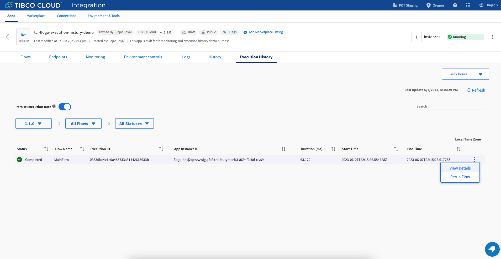

# TCI Flogo Execution History Sample

# Description

This is TCI-Flogo Execution History Sample.Execution History is used to capture the history of instances for flows inside an app. To store the execution instance,We can use the postgres DB as persistent layer. (*Currently, only Postgres DB is supported*)

## Pre-Requisite
1. Postgres DB running on-prem or on Cloud.
2. The flowstate, appstate and steps table are created inside the postgres DB. Please refer [This section](https://integration.cloud.tibco.com/docs/index.html#tci/using/hybrid-agent/hybrid-monitoring/exe-hist-flogo-configure-postgresql.html?Highlight=appstate) for more details.
3. Whitelist the regional NAT IP for TCI on your cloud DB security group. NAT IP's can be accessed for regions from [here](https://integration.cloud.tibco.com/docs/index.html#tci/getstarted/reference/whitelisting.html?Highlight=NAT%20IP) (*Applicable only for DB running on Cloud*)

### **Note:-In this demo, we have used the DB which is running on AWS Cloud as EC2 instance **

## Import the sample

1. Download the sample json file i.e., *tci-flogo-execution-history-demo-app.json*.

2. Create a new empty app

3. On the app details page, select import app option.

4. Now click on ‘browse to upload’ button and select the app.json from your machine that you want to import.

5. Click on Upload Button. The Import app dialog displays some generic errors and warnings as well as any specific errors or warnings pertaining to the app you are importing.

6. You have the option to import all flows from the source app or selectively import flows.

7.  Click Next. If you had not selected a trigger in the previous dialog, the flows associated with that trigger are displayed. You have the option to select one or more of these flows such that the flows get imported as blank flows that are not attached to any trigger. By default, all flows are selected. Clear the check box for the flows that you do not want to import. If your flow(s) have subflows, and you select only the main flow but do not select the subflow, the main flow gets imported without the subflow. Click Next.

## Enabling the Execution History for Org

1. Open the Platform API page, login with the access token and go to Organization section. 

2. Under the Organization section, click on the Enable Execution History API and select Flogo from option. Provide the payload as given below

3. Once the API is successfully run, you can check the status of the API using the Get Execution History status API. If you get the details of the payload you gave while enabling the Execution History,that means Execution History has been enabled for your org.

## Push App and Use Execution History

1. Once Execution Histroy is enabled for your org, wait for 2-4 minutes and Open the app details page and go to *Execution History* tab, You will see that the *Persist Execution Data* toggle is now displayed.  

2. Enable the *Persist Execution Toggle* to record the execution instances for your app. (*Note- You can disable it anytime when you do not want to record the execution instances*)

3. Push and scale the app and hit the endpoints.

4. After hitting endpoint,move to *Execution Histroy* Tab. You will get the list of execution record as shown below.

5. Click on the three dots beside an execution record and click on view details button. The execution record will display all the activities that got executed. 

 

6. Click on the input&Output Data for an activity. The details of the input and output data that went into the activity during execution will be displayed. (*Input & Output Data Currently Non Editable here*)

## Troubleshooting

* If you do not see the Endpoint enabled, make sure your apps is in Running status.
* If you see Enable Execution History API give you response stating that Hybrid proxy is not enabled then you can configure a hybrid agent for your org.
* If Get Execution History Status API returns the empty array in response, then either your org is legacy and does not support the Execution History feature or your DB configuration is not correct.

## Contributing

If you want to build your own activities for Flogo please read the docs here.

If you want to showcase your project, check out [tci-awesome](https://github.com/TIBCOSoftware/tci-awesome)

You can also send an email to `tci@tibco.com`

## Feedback
If you have feedback, don't hesitate to talk to us!

* Submit feature requests on our [TCI Ideas](https://ideas.tibco.com/?project=TCI) or [FE Ideas](https://ideas.tibco.com/?project=FE) portal
* Ask questions on the [TIBCO Community](https://community.tibco.com/answers/product/344006)
* Send us a note at `tci@tibco.com`

## Help
Please visit our [TIBCO Cloud&trade; Integration documentation](https://integration.cloud.tibco.com/docs/) and TIBCO Flogo® Enterprise documentation on [docs.tibco.com](https://docs.tibco.com/) for additional information.

## License
This TCI Flogo SDK and Samples project is licensed under a BSD-type license. See [license.txt](license.txt).

