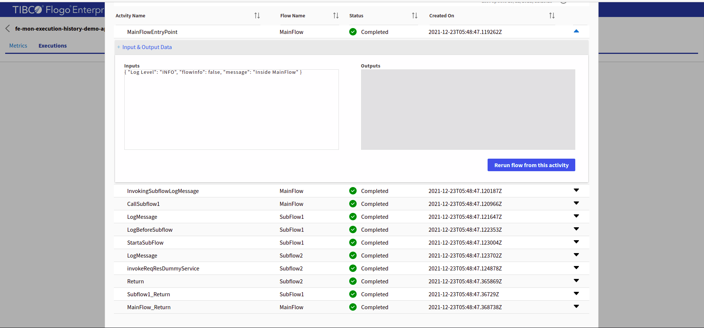

# Flogo Enterprise Monitoring and Execution History Sample

# Description

This is Flogo Enterpsie Monitoring and Execution History Sample.The Flogo Enteprise Monitoring is a licensed tool which can be used to monitor the Flogo apps running on-prem or apps running inside a Kubernetes cluster. Similarly Flogo Flow State Manager is used to capture the execution history for flows inside an app. We can use the postgres DB as persistent layer and store the execution history records inside the DB. The Flogo Flow state manager provides the re-run feature as well which will allow to re-run a flow from the Execution History screen.

## Pre-Requisite
1. Flogo Enterprise Monitoring app should be configured.
2. Flogo Flow State Manager app should be configured.
3. TCI subscription to generate the Flogo app executable locally.
4. Postgres DB running and configured with the Flow State Manager to store the execution records.

For more information on the configuration of Flogo Enterprise Monitoring, Flogo Flow State Manager and Postgres, Please refer [here](https://integration.cloud.tibco.com/docs/index.html#Subsystems/flogo/flogo-all/monitoring.html?TocPath=TIBCO%2520Flogo%25C2%25AE%2520Apps%257CDeployment%2520and%2520Configuration%257CBuilding%2520an%2520App%2520Executable%257CMonitoring%257C_____0)

## Import the sample
1. Download the sample json file i.e., *fe-mon-execution-history-demo-app.json*.

2. Create a new empty app

3. On the app details page, select import app option.

4. Now click on ‘browse to upload’ button and select the app.json from your machine that you want to import.

5. Click on Upload Button. The Import app dialog displays some generic errors and warnings as well as any specific errors or warnings pertaining to the app you are importing.

6. You have the option to import all flows from the source app or selectively import flows.

7.  Click Next. If you had not selected a trigger in the previous dialog, the flows associated with that trigger are displayed. You have the option to select one or more of these flows such that the flows get imported as blank flows that are not attached to any trigger. By default, all flows are selected. Clear the check box for the flows that you do not want to import. If your flow(s) have subflows, and you select only the main flow but do not select the subflow, the main flow gets imported without the subflow. Click Next.

## Understanding the configuration

In the attached sample *fe-mon-execution-history-demo-app.json*, there are 3 flows *MainFlow*, *Subflow1* and *Subflow2*.

First flow which is *MainFlow* calls the *Subflow1*  via call subflow activity. *Subflow1* further calls the *Subflow2* and *Subflow2* returns the output of the service which it is invoking to the *Subflow1*. *Subflow1* takes the output from the *Subflow2* and return this to *MainFlow*. *MainFlow* returns the output which it get from the *Subflow1*. 

### Generate and Run the App Executable

To generate the app executable, click on the hamburger menu option beside the push button and click on the *Build app* option. Select the supported Platform type and your app executable will be downloaded locally.

Once your app executable is generated and downloaded locally, Configure the app executable with the Flogo Monitoring app and Flogo Flow state manager app and run it.
For more information on the configuration, please refer the documentation link given below:-

1. To configure and run Flogo Enterprise Monitoring app, refer [here](https://au.integration.cloud.tibco.com/docs/index.html#Subsystems/flogo/flogo-all/running-the-flogo-en2.html)

2. To configure and run Flogo Flow State Manager app, refer [here](https://au.integration.cloud.tibco.com/docs/index.html#Subsystems/flogo/flogo-all/flowstatemgr-standalone.html)

3. To configure and run the Postgres DB Service with Flow state manager, refer [here](https://au.integration.cloud.tibco.com/docs/index.html#Subsystems/flogo/flogo-all/flowstatemgr-configure-postgresql.html?TocPath=Deployment%2520and%2520Configuration%257CBuilding%2520an%2520App%2520Executable%257CMonitoring%257CAbout%2520TIBCO%2520Flogo%25C2%25AE%2520Flow%2520State%2520Manager%257C_____2)

4. To configure and run the app executable with the Flogo Enterprise Monitoring and Flogo Flow State Manager app, refer [here](https://au.integration.cloud.tibco.com/docs/index.html#Subsystems/flogo/flogo-all/flowstatemgr-starting-flogo-app-binary.html?TocPath=Deployment%2520and%2520Configuration%257CBuilding%2520an%2520App%2520Executable%257CMonitoring%257CAbout%2520TIBCO%2520Flogo%25C2%25AE%2520Flow%2520State%2520Manager%257C_____8)

Once the executable is configured and running, Hit the app endpoint and open the Flogo Monitoring app in the browser with the url "*http://localhost:7337*" and you will see the app name in the app list.
On App list page, click on app name -> Monitoring -> Flow -> Trigger

For Execution History, Click in the *Executions* tab on the Flogo Enterprise Monitoring UI. You will see a list of the execution record and their start and end time. To capture the Executions record, one must enable the *Persist Execution Data* toggle. 

To re-run a flow from the Executions tab. Click on the Kebab Menu option beside an execution record and click on the *View Details* button. There will be a pop-up With the name Activities List and Execution id for a specific flow. Select an activity from which you want to re-run the flow. This feature works the same way as a Flow tester feature and does not include the app trigger in the re-run process.

## Outputs

1. App Monitoring

2. Execution Record

3. Re-run Feature

## Troubleshooting

* If you do not see the Endpoint enabled, make sure your apps is in Running status.
* If you see test connection failed in connection tab, then check your public ip if it is whitelisted or not.

## Contributing
If you want to build your own activities for Flogo please read the docs here.

If you want to showcase your project, check out [tci-awesome](https://github.com/TIBCOSoftware/tci-awesome)

You can also send an email to `tci@tibco.com`

## Feedback
If you have feedback, don't hesitate to talk to us!

* Submit feature requests on our [TCI Ideas](https://ideas.tibco.com/?project=TCI) or [FE Ideas](https://ideas.tibco.com/?project=FE) portal
* Ask questions on the [TIBCO Community](https://community.tibco.com/answers/product/344006)
* Send us a note at `tci@tibco.com`

## Help
Please visit our [TIBCO Cloud&trade; Integration documentation](https://integration.cloud.tibco.com/docs/) and TIBCO Flogo® Enterprise documentation on [docs.tibco.com](https://docs.tibco.com/) for additional information.

## License
This TCI Flogo SDK and Samples project is licensed under a BSD-type license. See [license.txt](license.txt).

