# Flogo Enterprise Monitoring and Execution History Sample

# Description

This is Flogo Enterpsie Monitoring and Execution History Sample.The Flogo Enteprise Monitoring is a licensed tool which can be used to monitor the Flogo apps running on-prem or apps running inside a Kubernetes cluster. Similarly Flogo Flow State Manager is used to capture the execution history for flows inside an app. We can use the postgres DB as persistent layer and store the execution history records inside the DB. The Flogo Flow state manager provides the re-run feature as well which will allow to re-run a flow from the Execution History screen.

## Pre-Requisite
1. Should have Flogo Enterprise Monitoring
2. Should have Flogo Flow State Manager
3. Should have TCI subscription to generate the Flogo Binary locally.
4.Should have Postgres DB running and configured with the Flow State Manager to store the execution records.

For more information on the configuration of Flogo Enterprise Monitoring, Flogo Flow State Manager and Postgres, Please refer [here](https://integration.cloud.tibco.com/docs/index.html#Subsystems/flogo/flogo-all/monitoring.html?TocPath=TIBCO%2520Flogo%25C2%25AE%2520Apps%257CDeployment%2520and%2520Configuration%257CBuilding%2520an%2520App%2520Executable%257CMonitoring%257C_____0)

## Import the sample
1. Download the sample json file i.e., *fe-mon-execution-history-demo-app.json*.

2. Create a new empty app

3. On the app details page, select import app option.

4. Now click on ‘browse to upload’ button and select the app.json from your machine that you want to import.

5. Click on Upload Button. The Import app dialog displays some generic errors and warnings as well as any specific errors or warnings pertaining to the app you are importing.

6. You have the option to import all flows from the source app or selectively import flows.

7.  Click Next. If you had not selected a trigger in the previous dialog, the flows associated with that trigger are displayed. You have the option to select one or more of these flows such that the flows get imported as blank flows that are not attached to any trigger. By default, all flows are selected. Clear the check box for the flows that you do not want to import. If your flow(s) have subflows, and you select only the main flow but do not select the subflow, the main flow gets imported without the subflow. Click Next.

## Understanding the configuration

In the attached sample *fe-mon-execution-history-demo-app.json*, there are 3 flows *Sx`et_Get_User1_Set_User2*, *Get_User2* and *Get_User1_User2_Delete_User2*.

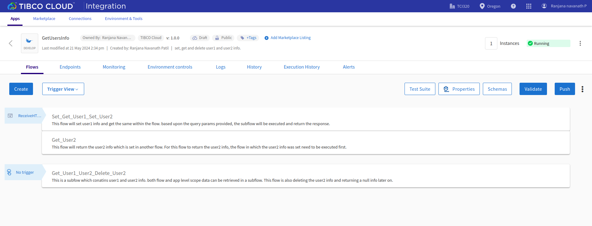

First flow which is *Set_Get_User1_Set_User2* sets the information about User1 in *flow* level scope with key *user1*.  

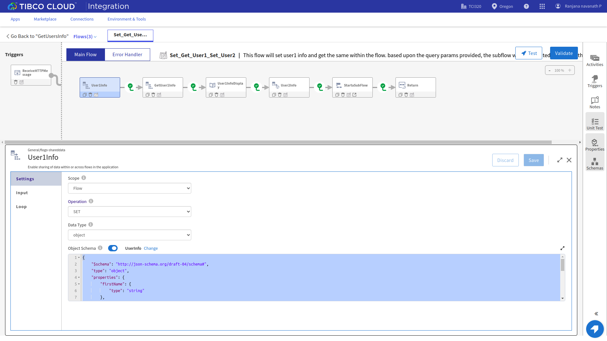
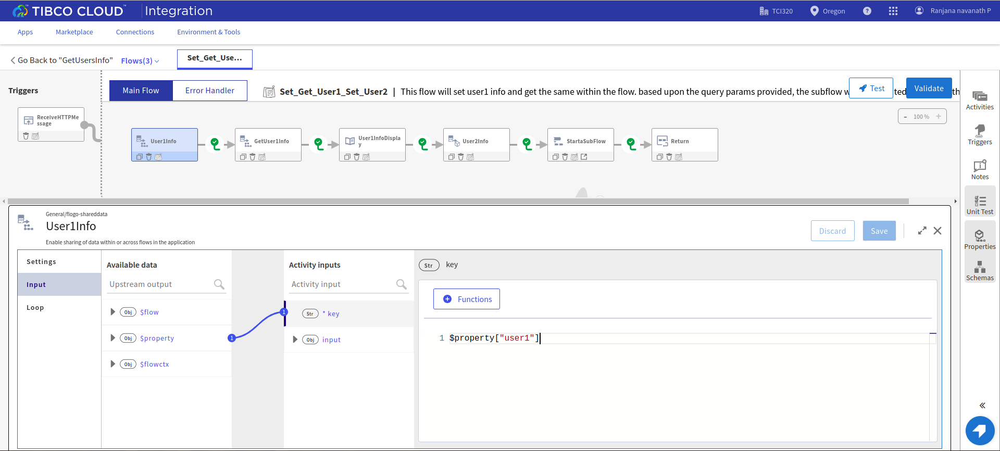

To get the User1 information in the same flow, the Get operation is used with the same key (*user1*).

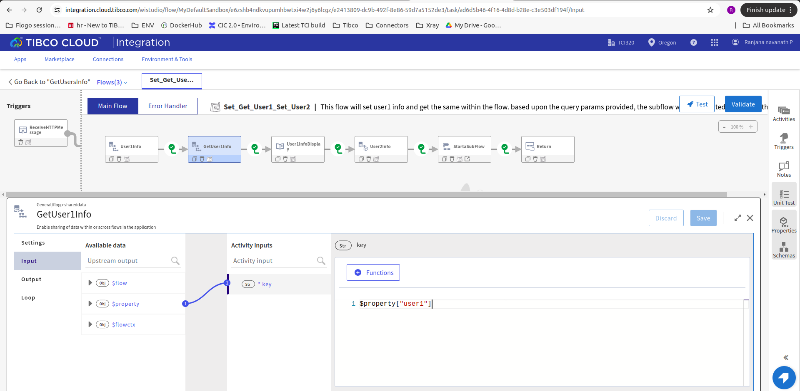

The flow also sets the User2 information with the *application* level scope with key *user2* and call a subflow *Get_User1_User2_Delete_User2*.

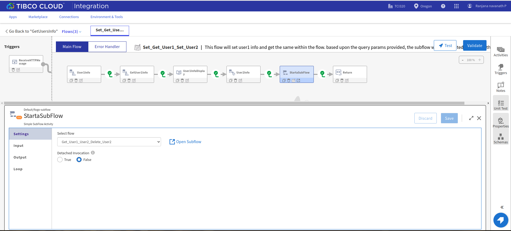

The flow *Get_User2* is another flow which gets the User2 information set in flow *Set_Get_User1_Set_User2*.

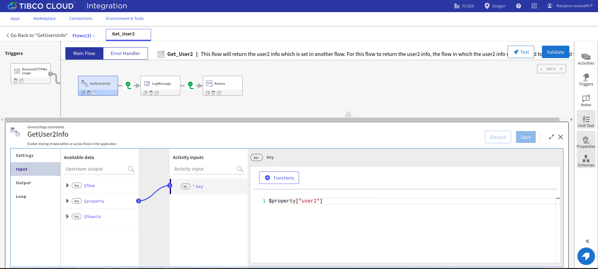

The flow *Get_User1_User2_Delete_User2* is a subflow to the main flow *Set_Get_User1_Set_User2* and gets the User1 information as well as User2 information based upon the input provided to the subflow. The input to the subflow is the same key which was set for user1 and user2 information.

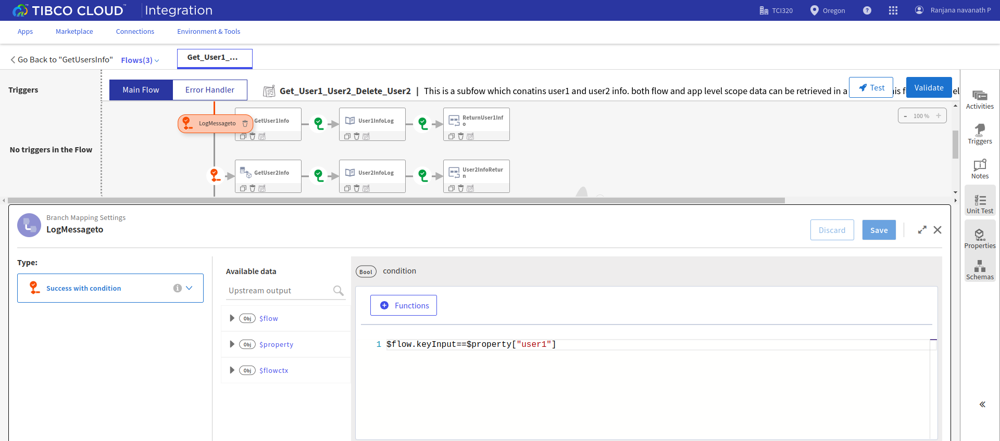
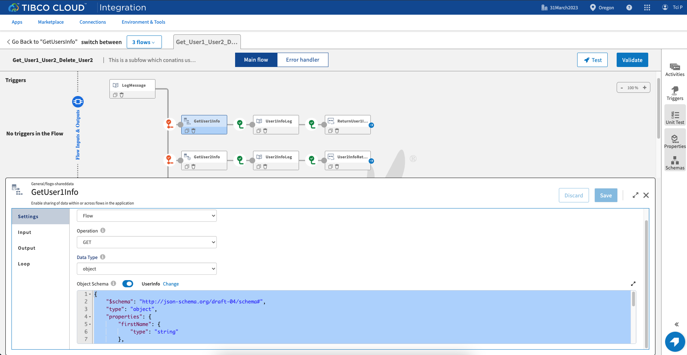
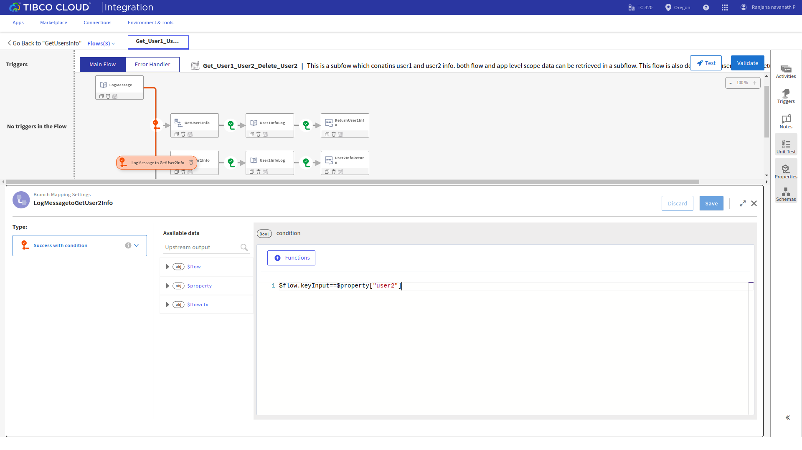
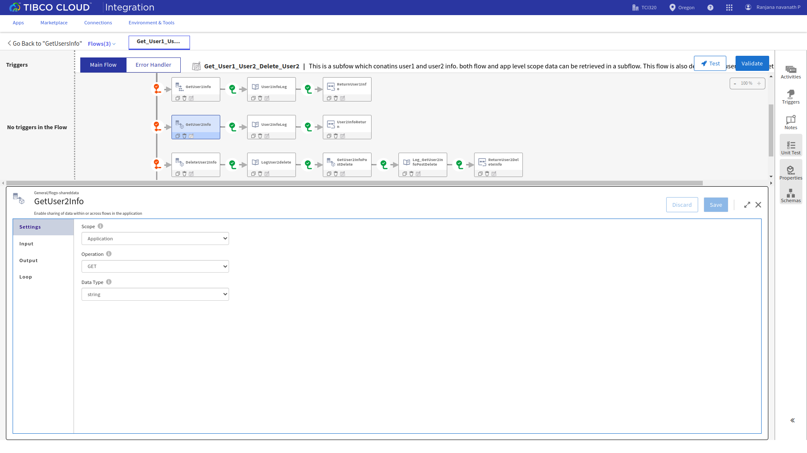
 
The flow also includes *Delete* operation for the User2 information which is  set at the *application* level scope. Based upon the *keyInput* and *isDelete* parameters from user, the respective user's information and operation will be performed.
For example, If user gives *keyInput* as "user2" and *isDelete* as true. The operation Delete will be performed on the User2 information. The same will be returned by the subflow *Get_User1_User2_Delete_User2* to the main flow *Set_Get_User1_Set_User2*.

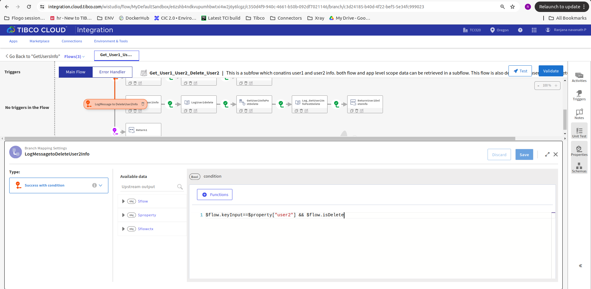
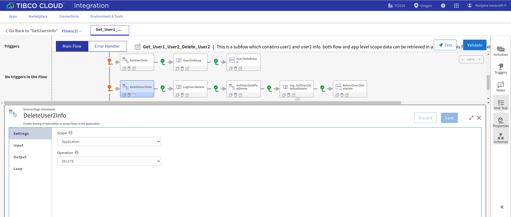

### Generate and Run the Application Binary

To generate the application binary, click on the hamburger menu option beside the push button and click on the *Build app* option. Select the Platform for which you want to generate the app binary and your app binary will be downloaded locally.

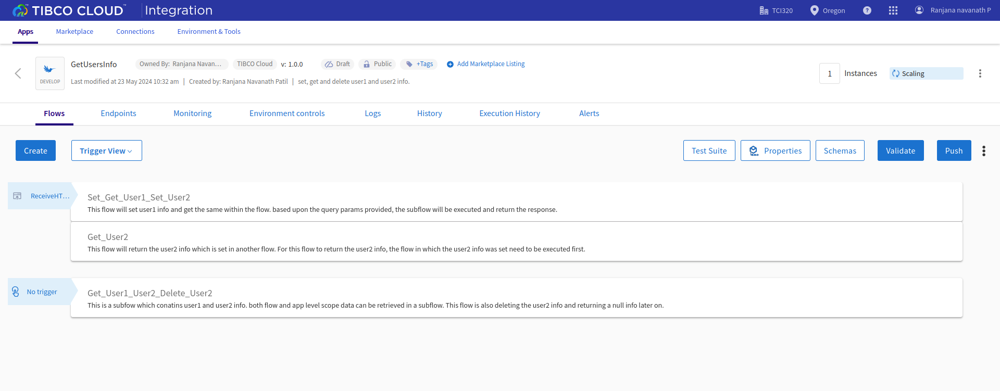

Once your app binary is generated and downloaded locally, Configure the app binary with the Flogo Monitoring app and Flogo Flow state manager app and run it.
For more information on the configuration, please refer the documentation link given above.

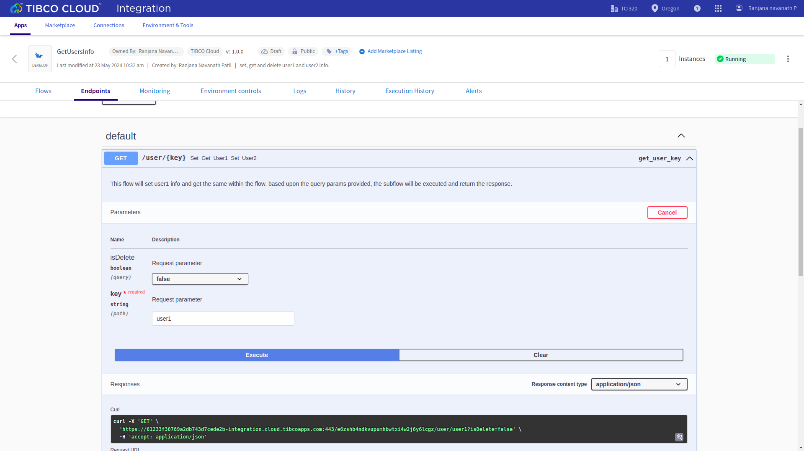

Once the binary is configured and running, open the Flogo Monitoring app in the browser and you will see the app name in the app list.
On App list page, click on app name -> Monitoring -> Flow -> Trigger

To watch the e

## Outputs

1. Flow Tester

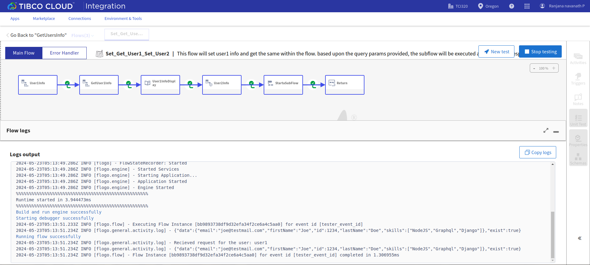

2. When hit endpoints

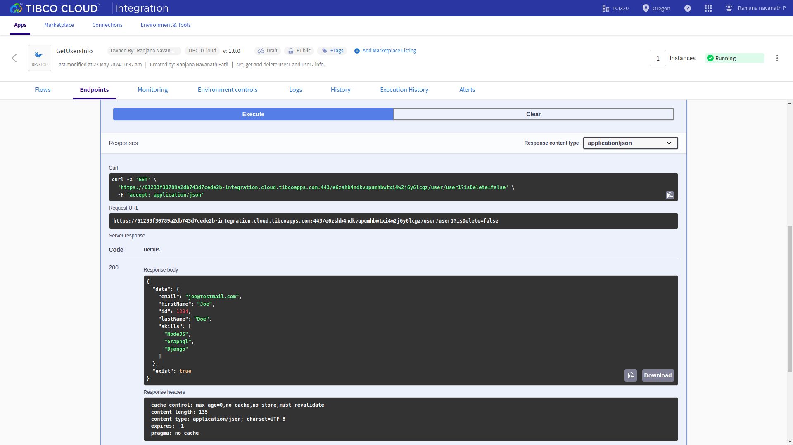

## Troubleshooting

* If you do not see the Endpoint enabled, make sure your apps is in Running status.
* If you see test connection failed in connection tab, then check your public ip if it is whitelisted or not.

## Contributing
If you want to build your own activities for Flogo please read the docs here.

If you want to showcase your project, check out [tci-awesome](https://github.com/TIBCOSoftware/tci-awesome)

You can also send an email to `tci@tibco.com`

## Feedback
If you have feedback, don't hesitate to talk to us!

* Submit feature requests on our [TCI Ideas](https://ideas.tibco.com/?project=TCI) or [FE Ideas](https://ideas.tibco.com/?project=FE) portal
* Ask questions on the [TIBCO Community](https://community.tibco.com/answers/product/344006)
* Send us a note at `tci@tibco.com`

## Help
Please visit our [TIBCO Cloud&trade; Integration documentation](https://integration.cloud.tibco.com/docs/) and TIBCO Flogo® Enterprise documentation on [docs.tibco.com](https://docs.tibco.com/) for additional information.

## License
This TCI Flogo SDK and Samples project is licensed under a BSD-type license. See [license.txt](license.txt).

