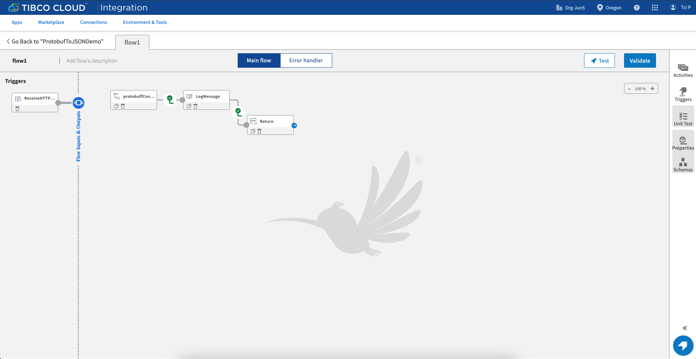
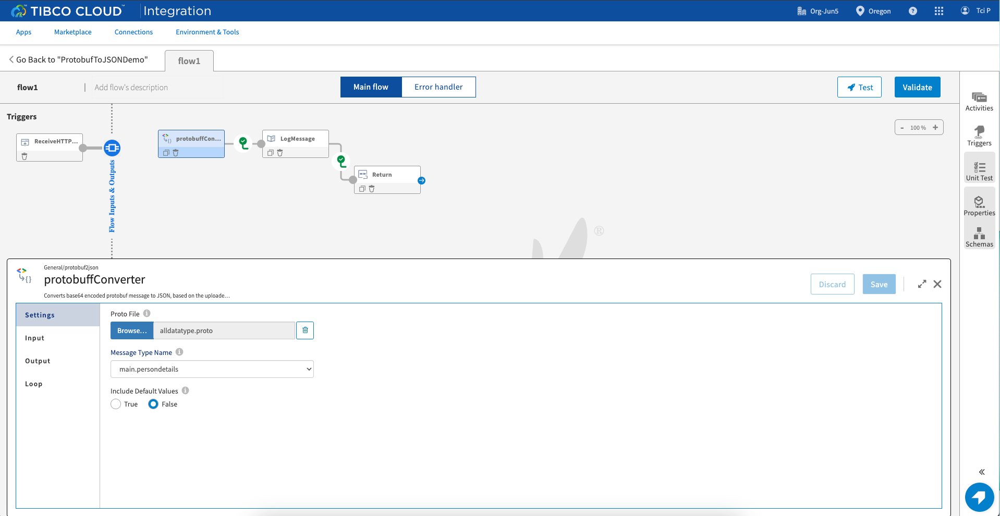
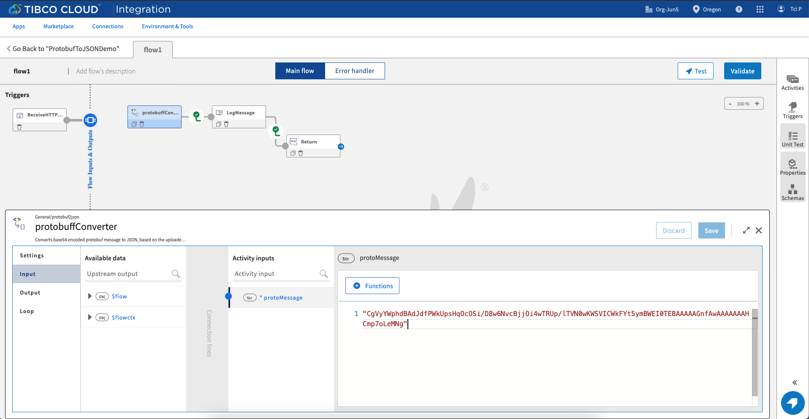
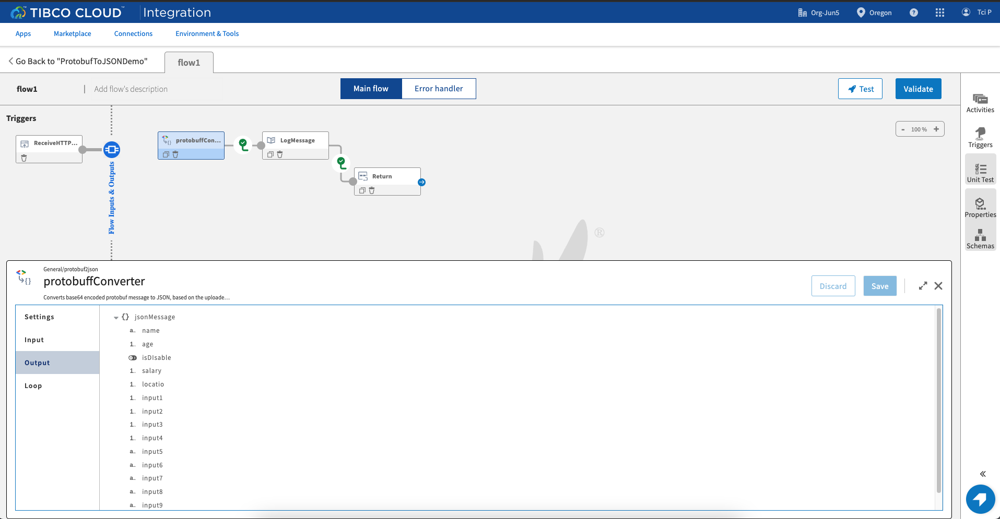
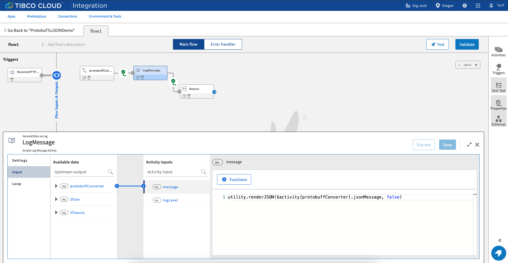
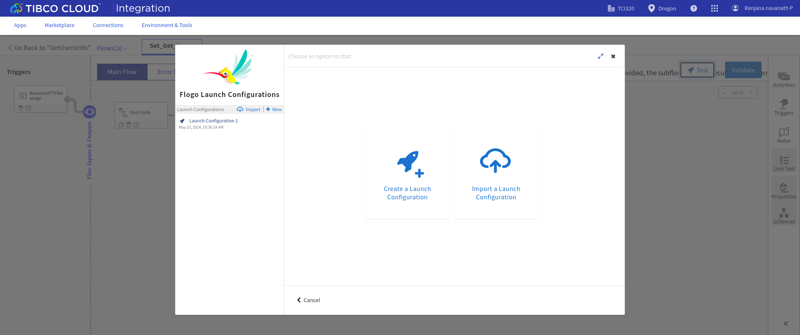
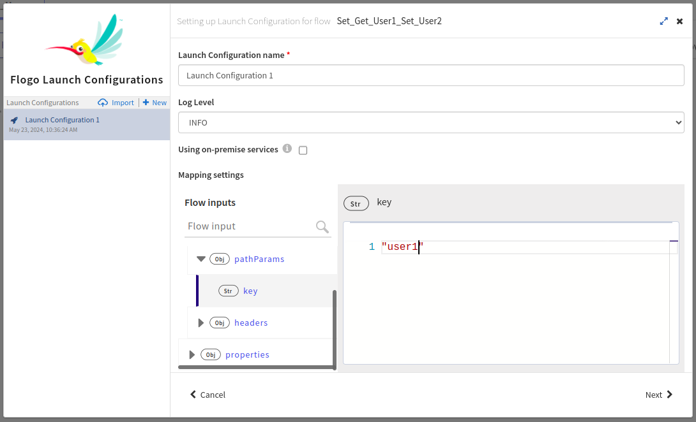
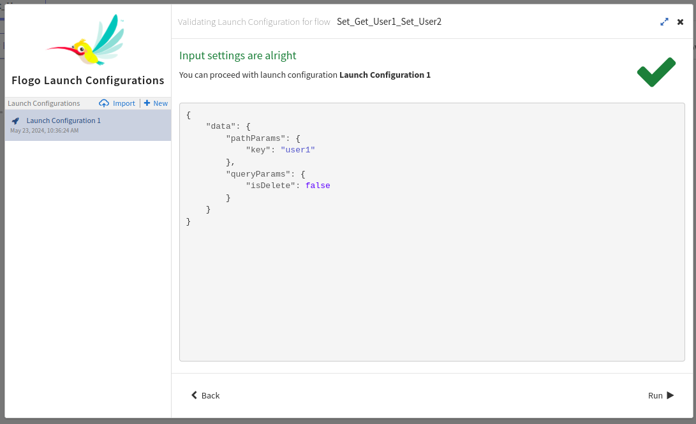

# ProtobufToJSON Activity Sample - Convert proto messages into JSON format

# Description

This is ProtobufToJSON activity sample.The ProtobufToJSON activity helps to convert the proto messages from an API or a gRPC service to respective JSON format.You can use the converted JSON data in any other supported activity like mapper or invokeRest activity. The activity requires a .proto file for the proto message format and a proto message in base64 encoded format as input. The current supported version for proto file is proto3. 

## Import the sample
1. Download the sample json file i.e., *ProtobufToJSONDemo.json*.

2. Create a new empty app

3. On the app details page, select import app option.

4. Now click on ‘browse to upload’ button and select the app.json from your machine that you want to import.

5. Click on Upload Button. The Import app dialog displays some generic errors and warnings as well as any specific errors or warnings pertaining to the app you are importing.

6. You have the option to import all flows from the source app or selectively import flows.

7.  Click Next. If you had not selected a trigger in the previous dialog, the flows associated with that trigger are displayed. You have the option to select one or more of these flows such that the flows get imported as blank flows that are not attached to any trigger. By default, all flows are selected. Clear the check box for the flows that you do not want to import. If your flow(s) have subflows, and you select only the main flow but do not select the subflow, the main flow gets imported without the subflow. Click Next.

## Understanding the configuration

In the attached sample *ProtobufToJSONDemo.json*, there is 1 flow *flow1* which contains one *ProtobufToJSON* activity.

The Settings tab of the activity shows the *.proto* file and *Message Type Name*. There is an *Include Default Values* radio button. If we select it as true, the output JSON will contain the default values for the fields which are having blank or null values in the proto message.  

The Input tab of the activity contains the *protoMessage* field which takes the encoded proto message as input in the mapper. If any rest service is giving a proto message response then we can map the output from invokeRest activity with the *protoMessage* field.

The output tab shows the respective JSON fields of the message once user uploads the proto file.

The *LogMessage* activity logs the output of the *ProtobufToJSON* activity.

### Run the application

To run the application, push the app to TIBCO Cloud and then scale up to 1 instance. Once your app is scaled, you can see your app in running status.

Once your app reaches to Running state, go to Endpoints and for GET/user/{key} option, select 'Try it Out’ option and then give "user1" as value in key and false in isDelete dropdown. Then click on execute.

Another option, If you want to test the sample in the Flow tester then follow below instructions:
 
in flow, click on Test Button -> create Launch configuration -> provide values in flow input (if any) -> click Next button -> click on Run

## Outputs

1. Flow Tester

2. When hit endpoints

## Troubleshooting

* If you do not see the Endpoint enabled, make sure your apps is in Running status.
* If you see test connection failed in connection tab, then check your public ip if it is whitelisted or not.

## Contributing
If you want to build your own activities for Flogo please read the docs here.

If you want to showcase your project, check out [tci-awesome](https://github.com/TIBCOSoftware/tci-awesome)

You can also send an email to `tci@tibco.com`

## Feedback
If you have feedback, don't hesitate to talk to us!

* Submit feature requests on our [TCI Ideas](https://ideas.tibco.com/?project=TCI) or [FE Ideas](https://ideas.tibco.com/?project=FE) portal
* Ask questions on the [TIBCO Community](https://community.tibco.com/answers/product/344006)
* Send us a note at `tci@tibco.com`

## Help
Please visit our [TIBCO Cloud&trade; Integration documentation](https://integration.cloud.tibco.com/docs/) and TIBCO Flogo® Enterprise documentation on [docs.tibco.com](https://docs.tibco.com/) for additional information.

## License
This TCI Flogo SDK and Samples project is licensed under a BSD-type license. See [license.txt](license.txt).

