# 1. Setup Your Environment

In this section, you'll validate your lab environment, which consists of a client machine and a TIBCO Cloud Integration trial environment.

## 1.1 Sign up to TIBCO Cloud ##
You can skip this section and move to [1.3](#1.3) if you have already signed up to a trial of TIBCO Cloud™ Integration.

### 1.1.1 Getting Ready ###

To sign up to the TIBCO Cloud [click here](https://account.cloud.tibco.com/signup/tci) and fill in the form, choosing Europe as a region). 

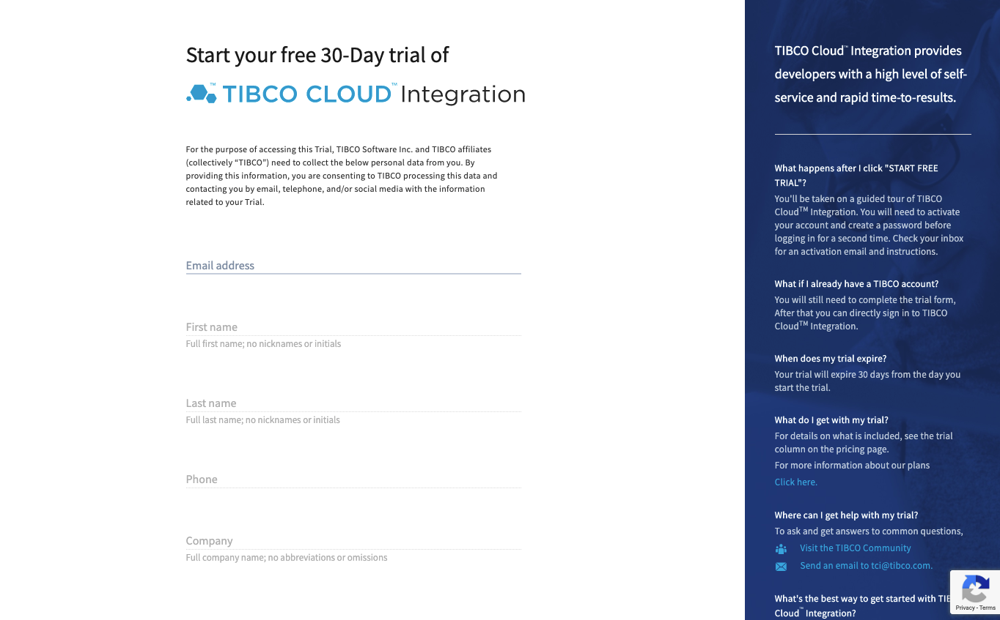

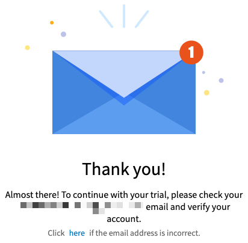

### 1.1.2 Respond to your activation email

Once you have submitted your sign up form, you will be sent an Activation email that you will need to use to Activate your trial subscription. If you have not received this email within 10 minutes, please check your Junk or Promotions folder!

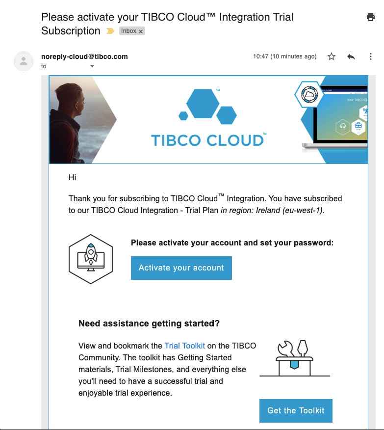

After clicking on the link in the email - you will need to finalise your details and set up your password for your TIBCO Account.

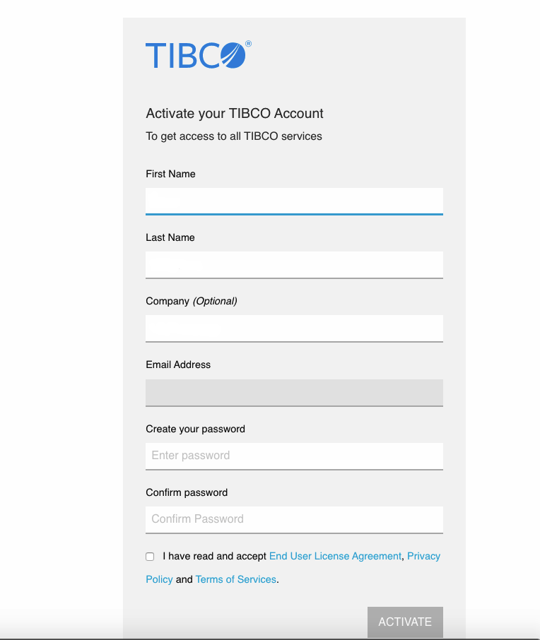

### 1.1.3 Welcome to the TIBCO Cloud!

Once activated, you will be taken directly to the TIBCO Cloud home page, where you will be asked to complete a small form to help identify the most appropriate capabilities you will be using.

### 1.1.4 Sign in to the TIBCO Cloud ###

1. Browse to [https://cloud.tibco.com/](https://cloud.tibco.com/).

    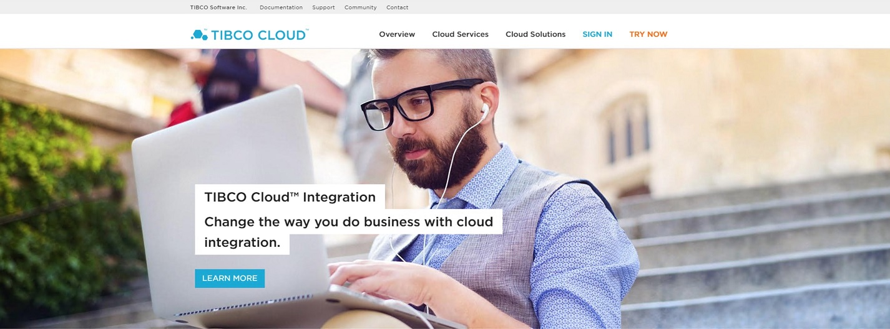
2. Click **SIGN IN** (at the right top), and fill out the relevant account details (**Email Address** and **Password**) in the following screen.

    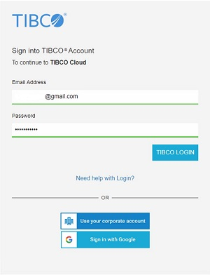
3. After this, you should see a landing page which looks similar to this:

    

--

## 1.2 Add Subscription...

At the moment the capability for Event Processing and Messaging are not enabled . You will need to add additional capabilities for Event Processing and Messaging to your trial account. On the home screen click the **Subscriptions** menu option at the top of the screen.

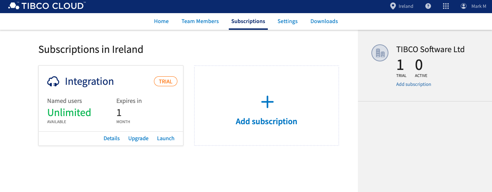

Click **Add subscription**. A selection of available TIBCO Cloud platform capabilities will be shown...

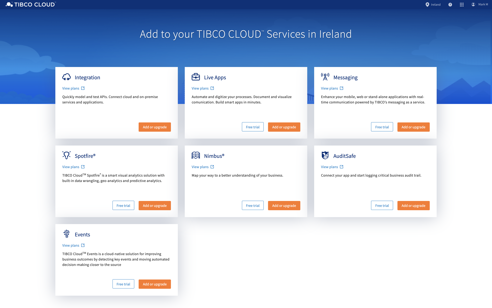

1.3.1 TIBCO Cloud Messaging

Click **Free Trial** in the Messaging tile... 

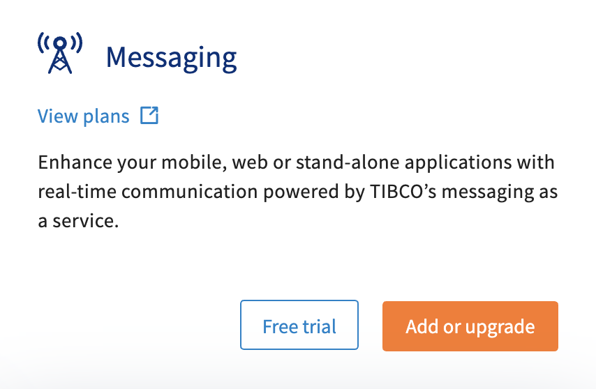 

You will be prompted to start a 30 day trial of TIBCO Cloud Messaging. Scroll to the bottom of the page and click **I agree to the End User License Agreement and the Privacy Policy** tick box. Choose your marketing preferences consent and then Click **START FREE TRIAL**.

You can navigate directly to the sign-up page [here](https://eu.account.cloud.tibco.com/signup/TCM).

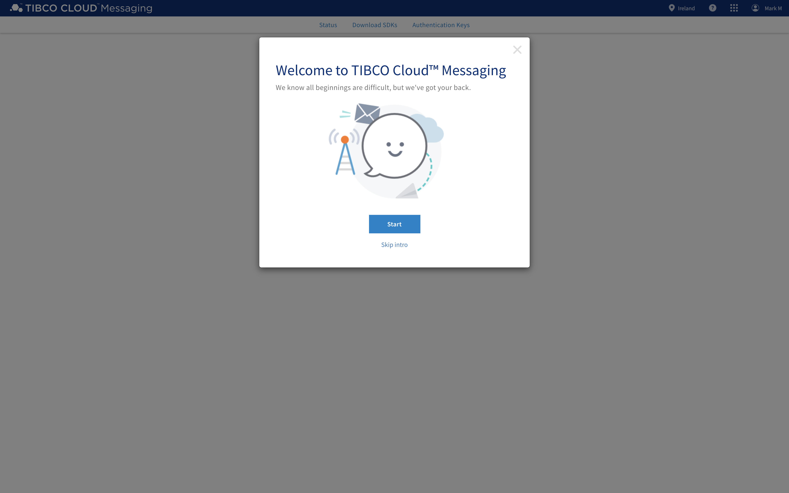

You now have access to TIBCO Cloud Messaging (TCM). We will come back to TCM later to configure access, in the meantime please navigate back to the [subscription page](https://eu.account.cloud.tibco.com/manage/subscription) so we can add TIBCO Cloud Events.

1.3.2 TIBCO Cloud Events

Click **Free Trial** in the Events tile... 

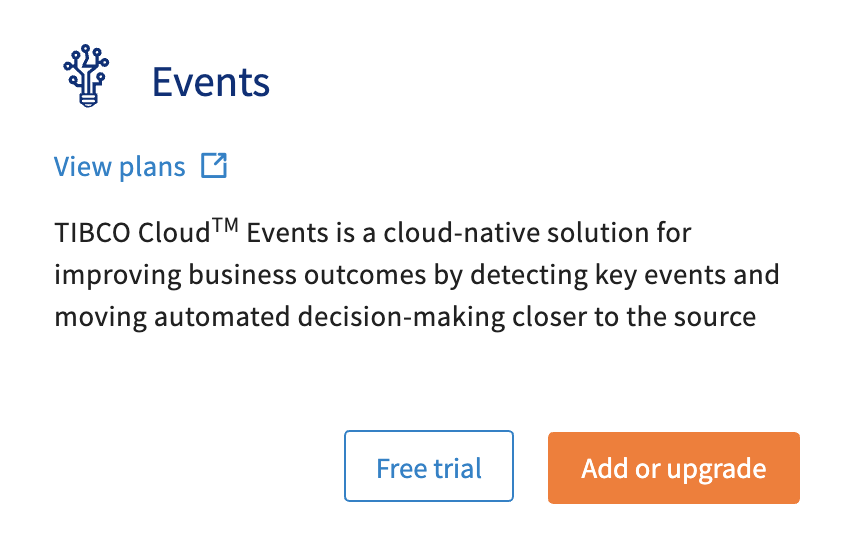 

You will be prompted to start a 30 day trial of TIBCO Events. Scroll to the bottom of the page and click **I agree to the End User License Agreement and the Privacy Policy** tick box. Choose your marketing preferences consent and then Click **START FREE TRIAL**.

--

## 1.3 Download and Install...

### 1.3.1 TIBCO Business Studio™ 

* [TIBCO Business Studio™ for BusinessWorks™](https://eu.integration.cloud.tibco.com/download)

### 1.3.2 TIBCO Cloud™ Events Studio 

* [TIBCO Cloud Events Studio](https://eu.events.cloud.tibco.com/index.html#!/downloads)

### 1.3.3 Postman

* [Postman](https://www.getpostman.com/downloads/)

### 1.3.4 Download Github Repository:

1. Browse to [https://github.com/TIBCOUK/AsyncAPIs](https://github.com/TIBCOUK/AsyncAPIs)
2. Download zip file to your local hard drive

    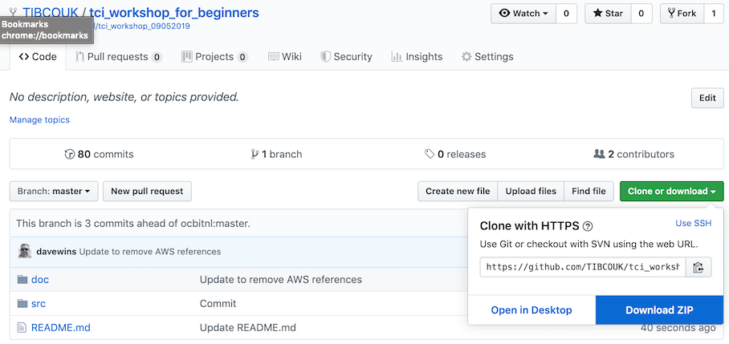

3. Extract the contents from the downloaded zipfile

### 1.3.5 Download TCM Java SDK

1. Browse to [https://eu.messaging.cloud.tibco.com/tcm/ui/downloads](https://eu.messaging.cloud.tibco.com/tcm/ui/downloads)
2. Download the Java / Android SDK
3. Extract the contents from the downloaded zipfile

--

# 1.4 Create TCM Authentication Key

1. Browse to [https://eu.messaging.cloud.tibco.com/tcm/ui/admin](https://eu.messaging.cloud.tibco.com/tcm/ui/admin)

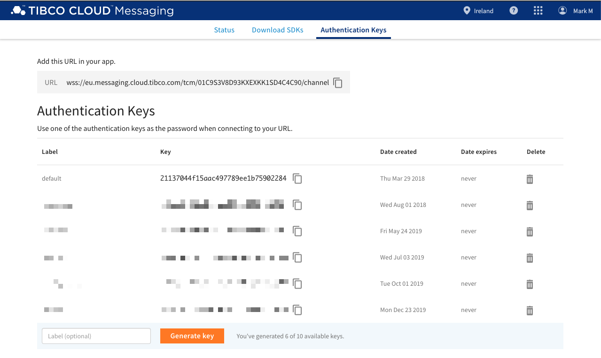

2. Enter 'tc-workshop' in the label box and click 'Generate Key'.

Make a note of URL and Key as you'll be needing these later.

    
## 1.5 What's Next

[Business Transactions in a Microservice Architecture](001.md)
