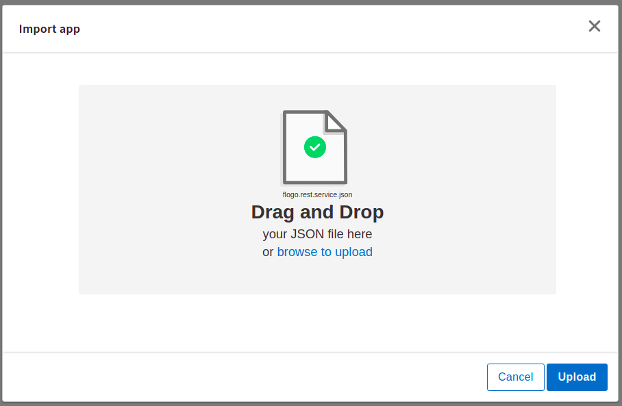
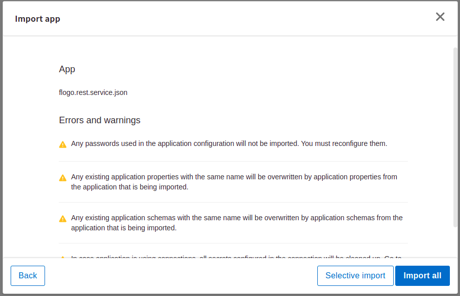
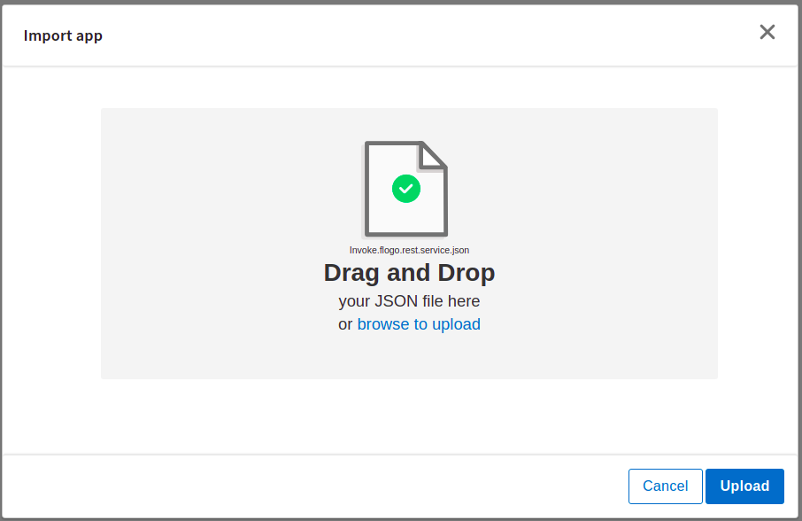
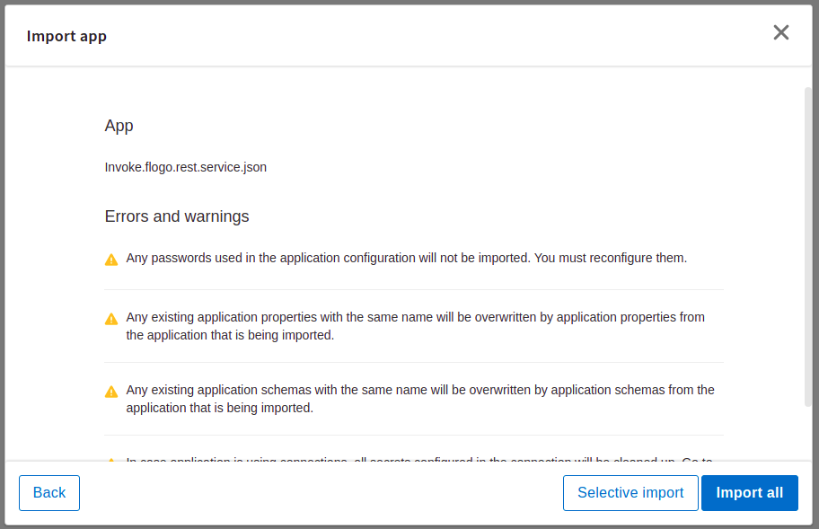
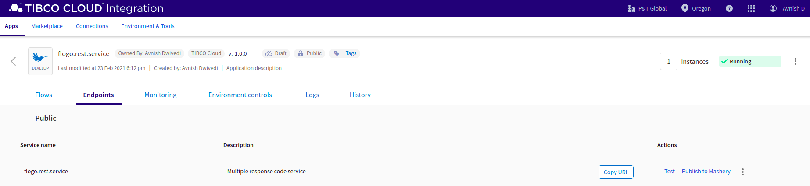
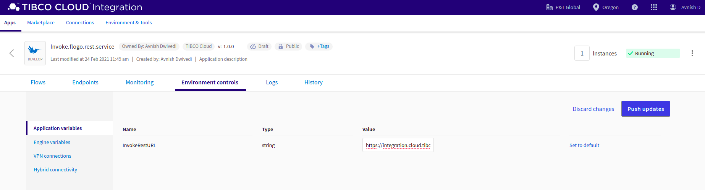
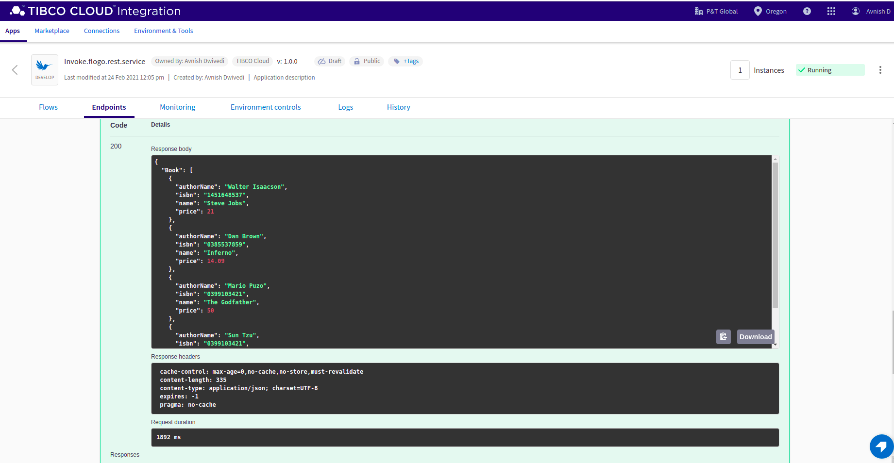
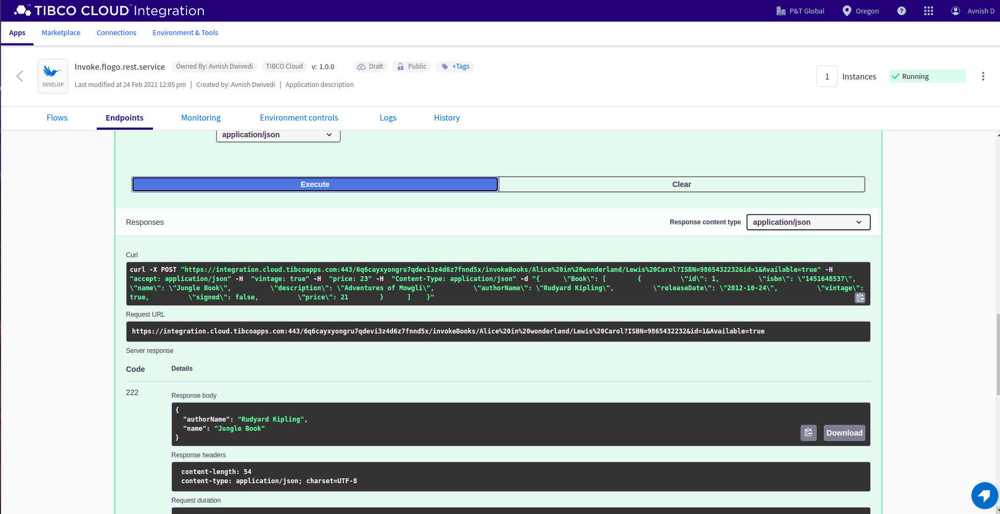
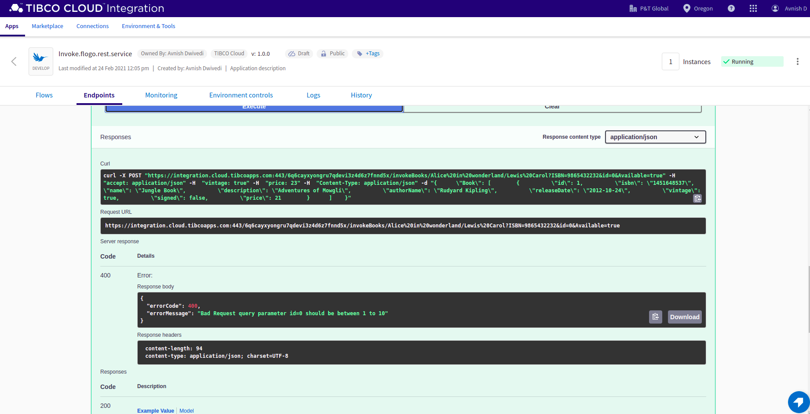
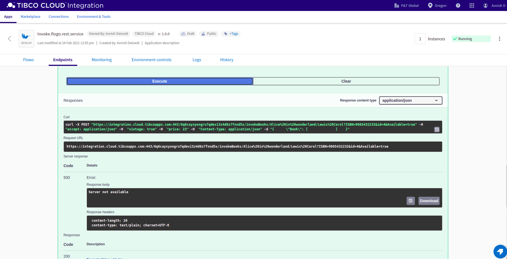

# REST Features Sample

This sample demonstrates some of the REST features present in the FLOGO ReceiveHTTPMessage trigger and InvokeRestService activity. Features which are covered in these sample apps are:
## ReceiveHTTPMessage trigger
1. Path, query and header params in the REST trigger.
2. Configure multiple response code in REST trigger.
3. Response Headers in REST trigger.
4. App level schema in Request Schema and mapper activities.
5. Multiple branching for each Response code.
6. ConfigureHTTPResponse activity to do multiple response mapping with Return activity.

## InvokeRestService activity
1. Configuring InvokeRest activity with the API Spec of the producer REST service.
2. Path, query, header parameters and Request and Response schema will be auto-populated.
3. Branching with condition on the Response code received from the invoked service.
4. App property for the URL field whch can be overriden at runtime as per the request URL. 

## Import the sample apps
 
1. Download the sample's .json files 'flogo.rest.service.json' and 'Invoke.flogo.rest.service.json', apps for producer and consumer services respectively.

2. Create a new empty app.

3. On the app details page, select Import app.

4. Browse on your machine or drag and drop the .json files for the app that you want to import.

5. Click Upload. The Import app dialog displays some generic errors and warnings as well as any specific errors or warnings pertaining to the app you are importing. It validates whether all the activities and triggers used in the app are available in the Extensions tab.

6. You have the option to import all flows from the source app or selectively import flows.

7. If you choose selective import, select the trigger, flow and connection. Click Next.

8. After importing the 'flogo.rest.service' app(producer app), repeat the above steps to import the Invoke.flogo.rest.service app(consumer app).

## Run the application

Once you have imported both the apps, push the 'flogo.rest.service' app first and scale the app to 1. Now we need to get the endpoint the producer service, go to the 'Endpoint' tab of the app and click on 'Copy URL' to get the endpoint URL.

Now push the 'Invoke.flogo.rest.service' app and scale the app to 1. Go to 'Environment Controls' tab -> 'Application Variables' and edit the default value of the 'InvokeRestURL' application property to point to the endpoint URL of the producer Rest service app.

## Output

1. Sample response for 200 Success 

2. Sample response for 222 custom code 

3. Sample response for 400 error

4. Sample response for 500 error

## Troubleshooting

If you do not see the Endpoint enabled, make sure your apps is in Running status.
The responses are received upon meeting a particular condition, please check the branch conditions.
If  Invoke.flogo.rest.service app is not returning expected response, please check if the 'InvokeRestURL' application property is pointing to the right endpoint URL.
For expected payload and parameters, please refer the Resources folder.

## Contributing

If you want to build your own activities for Flogo please read the docs here.

If you want to showcase your project, check out [tci-awesome](https://github.com/TIBCOSoftware/tci-awesome)

You can also send an email to `tci@tibco.com`

## Feedback
If you have feedback, don't hesitate to talk to us!

* Submit feature requests on our [TCI Ideas](https://ideas.tibco.com/?project=TCI) or [FE Ideas](https://ideas.tibco.com/?project=FE) portal
* Ask questions on the [TIBCO Community](https://community.tibco.com/answers/product/344006)
* Send us a note at `tci@tibco.com`

## Help

Please visit our [TIBCO Cloud&trade; Integration documentation](https://integration.cloud.tibco.com/docs/) and TIBCO Flogo® Enterprise documentation on [docs.tibco.com](https://docs.tibco.com/) for additional information.

## License
This TCI Flogo SDK and Samples project is licensed under a BSD-type license. See [license.txt](license.txt).
