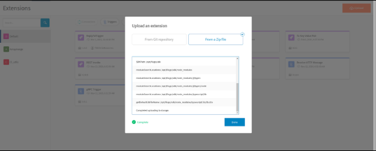
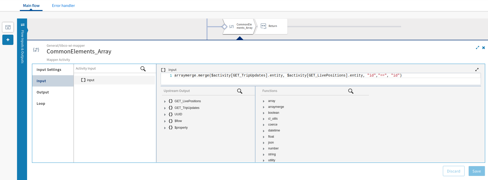
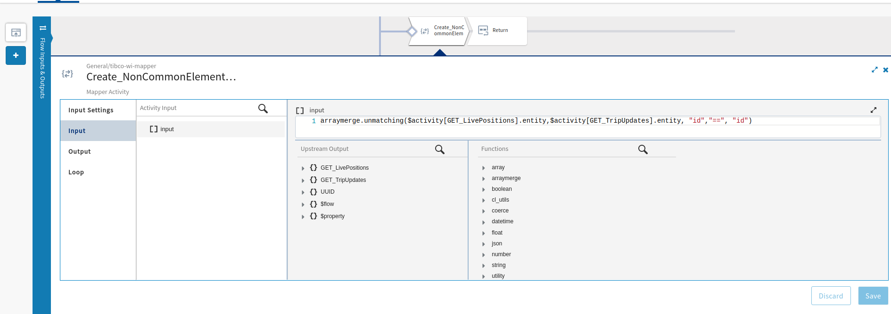

# Merge Object arrays based on mapping condition Extension

## Overview
Custom extension function to merge the two arrays based on common elements or based on the condition that you want pass-in. You can use any conditional operator with these functions.
We have two functions available here in this custom extension as shown below,
## Usage details

### Syntax: merge(array1, array2, fieldInArray1, operator, fieldInArray2)
### Syntax: unmatching(array1, array2, fieldInArray1, operator, fieldInArray2)

## Example:
### Syntax with input parameters: 
    arraymerge.merge($activity[GET_TripUpdates].entity, $activity[GET_LivePositions].entity, "id","==", "id")
   This function will merge both arrays where id is matching and create a new output array that has elements from both arrays. 
   The unmatching elements from both arrays will be ignored.

    arraymerge.unmatching($activity[GET_LivePositions].entity,$activity[GET_TripUpdates].entity, "id","==", "id")
  This function will return all the unmatching elements from array1 (GET_LivePositions) where id from array1 is not-matching with array2 (GET_TripUpdates). 
  You need to make sure that you should place that array as a first parameter  from which you do not wish to lose the data. All the data from array2 will be ignored. 

## Steps to use the Array Merge extension:
* Download the extension on your file system from here.
* Login to TIBCO Cloud™ Integration with a valid subscription. 
* Select Environment & Tools menu option.
* Under Connector Management & Extensions section, choose Extensions option. 
* Under Extensions, select the Upload button. 
* Select “From a Zip File” tab and navigate to the zip file on your file system as shown in the snapshot below. (from step #1) This step will upload the extension and make it available to use in the Flogo flows. 
* You can access the custom functions within functions sections with name arraymerge category

## Sample Apps for Reference 

Please refer to any of the available sample apps [Here](https://github.com/TIBCOSoftware/tci-flogo/tree/master/samples/app-dev/Array-Operations)
* FindCommonArrayElement-UsingCustomExtension
* FindCommonArrayElements
* Find_NonCommonArrayElement-UsingCustomExtension
* Find_NonCommonArrayElements
