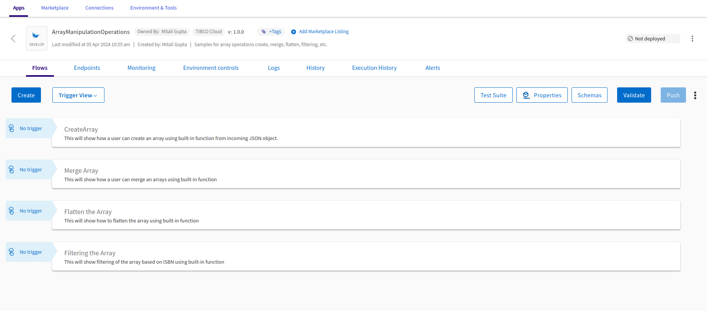

 # Basic Array Operations

## Prerequisites
TIBCO Cloud™ Integration - latest version. 

## Overview
This application will demonstrate you how quickly users can use/leverage the built-in functions to perform different array operations to achieve business requirements.

Here, we’re demonstrating 4 different widely used and required array operations like,
1. Create Array
2. Mere Array
3. Flatten Array
4. Filtering of the Array

## Steps to use the Flogo application: 
1. Download the Flogo application (JSON file) from [here](https://github.com/TIBCOSoftware/tci-flogo/blob/master/samples/marketplace/Array-Operations/Basic_Manipulations/ArrayManipulationOperations.json).
2. Login to TIBCO Cloud™ Integration with a valid subscription.
3. Steps to import the Flogo application (from step #1) is listed [here](https://github.com/TIBCOSoftware/tci-flogo/blob/master/samples/app-dev/readme.md).
4. The imported Flogo app should look like shown below.
For any additional information, please raise your queries or issues via the Issues section.
