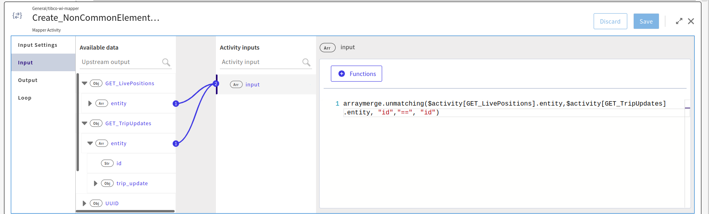

# Merge arrays based on matching and non-matching elements

## Prerequisites
TIBCO Cloud™ Integration - latest version. 

## Overview
This is a custom extension (function) to merge two arrays based on matching or non-matching identifiers. The identifier in this application is an ID but can be a different field which is common across both arrays. Two different functions are available as part of this custom extension. The extension is optimized for enterprise usage and from a scalability perspective.

## Usage details:

## Syntax:
merge(array1, array2, fieldInArray1, operator, fieldInArray2)
unmatching(array1, array2, fieldInArray1, operator, fieldInArray2)

## Example:
arraymerge.merge($activity[GET_TripUpdates].entity, $activity[GET_LivePositions].entity, "id","==", "id")

This function merges both arrays based on the matching ID (common field) across both arrays and creates a new output array containing elements from both arrays. The unmatching elements from both arrays will be ignored.

arraymerge.unmatching($activity[GET_LivePositions].entity,$activity[GET_TripUpdates].entity, "id","==", "id")

This function returns all the unmatching elements from array1 only (GET_LivePositions) where ID (common field) from array1 is not-matching with array2 (GET_TripUpdates). 

## Note: 
Unmatching elements from only array 1 are returned as output array. 

## Steps to use the Array Merge extension:
1. Download the extension on your file system from [here.](https://github.com/TIBCOSoftware/tci-flogo/blob/master/samples/extensions/ArrayMergeOperaton/array_merge.zip)
2. Login to TIBCO Cloud™ Integration with a valid subscription. 
3. Upload the extension following the instructions from [here.](https://github.com/TIBCOSoftware/tci-flogo/blob/master/samples/extensions/Readme.md)
4. You can now access the function (as shown below) under the Functions section by the name, arraymerge.

## Reference applications 
1. Flogo application to demonstrate the usage of unmatching() can be downloaded from [here.](https://github.com/TIBCOSoftware/tci-flogo/blob/master/samples/marketplace/Array-Operations/Find_NonCommonArrayElement-UsingCustomExtension/FindNonCommon_ArrayElement_UsingCustomExtension.json)
2. Flogo application to demonstrate the usage of merge() can be downloaded from [here.](https://github.com/TIBCOSoftware/tci-flogo/blob/master/samples/marketplace/Array-Operations/FindCommonArrayElement-UsingCustomExtension/FindCommon_ArrayElement-UsingCustomExtension.json)
3. Steps to import Flogo application can be found [here.](https://github.com/TIBCOSoftware/tci-flogo/tree/master/samples/app-dev)
