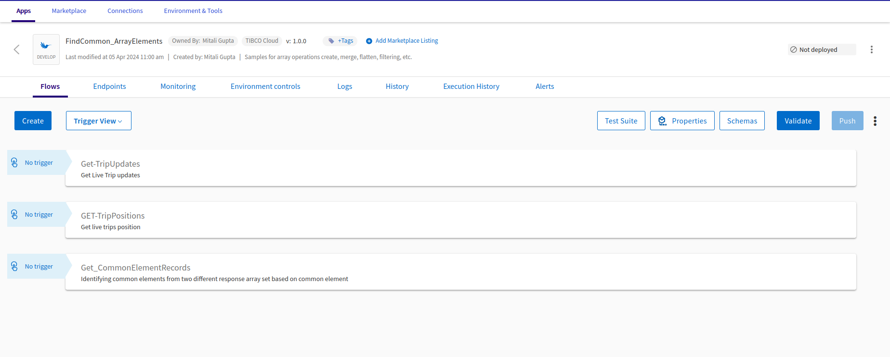

# Merge arrays based on matching elements using built-in features.

## Prerequisites
- TIBCO Cloud™ Integration 

## Overview
This application flow will demonstrate, how quickly one can use built-in features (ex. loops & conditions) to identify the common elements from arrays. 
Furthermore, it will generate a new array of common elements.

The only drawback of this approach, application performance degrades if the array size is too large. 
It will cause the application to perform slowly & sometimes crashes.

You can look for the custom extension build to handle the huge array size with better performance and it is available [here.](https://github.com/TIBCOSoftware/tci-flogo/tree/master/samples/app-dev/Array-Operations/FindCommonArrayElement-UsingCustomExtension)

## Steps to use the Flogo application:
1. Download the Flogo application (JSON file) from [here.](https://github.com/TIBCOSoftware/tci-flogo/blob/master/samples/marketplace/Array-Operations/FindCommonArrayElements/FindCommon_ArrayElements.json)
2. Login to TIBCO Cloud™ Integration with a valid subscription.
3. Steps to import the Flogo application (from step #1) is listed [here.](https://github.com/TIBCOSoftware/tci-flogo/blob/master/samples/app-dev/readme.md)
4. The imported Flogo app should look like shown below.
5. For any additional information, please raise your queries or issues via the Issues section.
