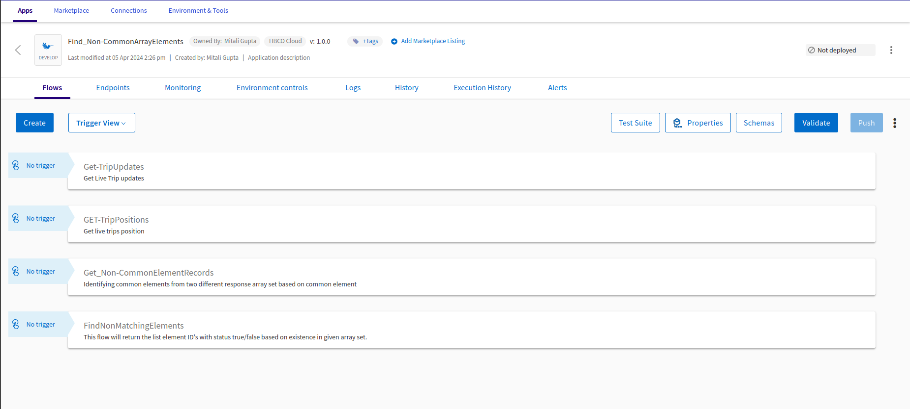

# Merge arrays based on non-matching elements using built-in features. 

## Prerequisites
- TIBCO Cloud™ Integration

## Overview

This application will demonstrate, how user can use built-in features ex.loops & conditions in mapping to create an array of non-matching elements from two diffrent arrays.
The application leverages the different built-in activities and functions to identify and create new array of non-matching elements.

The only drawback of this approach, performance degrades if the array size is too large. Sometimes, it will cause the slowness and sometimes app crashes if memory accumulation goes beyond available.

You can look to the custom extension build to handle the huge array size with best performance. It is available [here.](https://github.com/TIBCOSoftware/tci-flogo/tree/master/samples/app-dev/Array-Operations/Find_NonCommonArrayElement-UsingCustomExtension)

## Steps to use the Flogo application:
1. Download the Flogo application (JSON file) from [here.](https://github.com/TIBCOSoftware/tci-flogo/blob/master/samples/marketplace/Array-Operations/Find_NonCommonArrayElements/Find_Non-CommonArrayElements.json)
2. Login to TIBCO Cloud™ Integration with a valid subscription.
3. Steps to import the Flogo application (from step #1) is listed [here.](https://github.com/TIBCOSoftware/tci-flogo/tree/master/samples/app-dev#readme)
4. The imported Flogo app should look like shown below.
5. The imported Flogo app should look like shown below. For any additional information, please raise your queries or issues via the Issues section.
