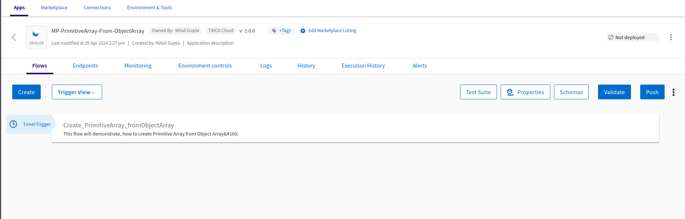

#  Creating Primitive Array from Object Array

## Prerequisites
- TIBCO Cloud™ Integration

## Overview
This application will demonstrate you how quickly users can use/leverage the built-in functions & features to convert or create a new primitive type array from an array of objects. 

Usually, almost every system (databases, ERP, CRM) provides the array of objects for processing and sometimes it's required to convert those array of objects into primitive array types. And in this application will show quick way to create it. 

## Steps to use the Flogo application
- Download the Flogo application (JSON file) from [here.](https://github.com/TIBCOSoftware/tci-flogo/blob/master/samples/marketplace/Array-Operations/PrimitiveArray_from_ObjectArray/MP-PrimitiveArray-From-ObjectArray.json) 
- Login to TIBCO Cloud™ Integration with a valid subscription.
- Steps to import the Flogo application (from step #1) is listed [here.](https://github.com/TIBCOSoftware/tci-flogo/blob/master/samples/app-dev/readme.md)
- The imported Flogo app should look like shown below.

For any additional information, please raise your queries or issues via the Issues section
