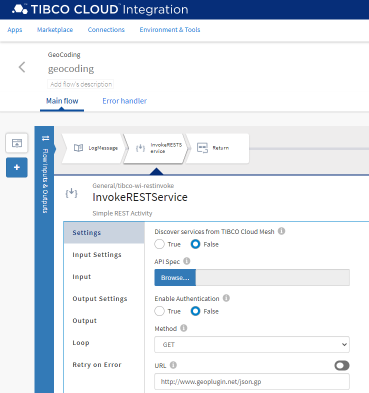

# GEOCoding via ClientIP

## Overview
This sample is a simple Flogo app that allows to return GEO Details from a Web Client IP. It uses a HTTP trigger to receive a HTTP message with the following parameters:

* Port: 9999
* Method: GET
* Resource path: `/geo/{ip}`



This Flogo Sample Implementation is using a free Service for IP Geolocation by geoPlugin

### Input
Flow Input parmeters:

```json
	"properties": {
		"ip": {
			"type": "string"
		}
	}
```

### Output
Flow Output parameters

```json
	"properties": {
		"ip": {
			"type": "string"
		},
		"countryCode": {
			"type": "string"
		},
		"regionCode": {
			"type": "string"
		},
		"city": {
			"type": "string"
		},
		"latitude": {
			"type": "string"
		},
		"longitude": {
			"type": "string"
		},
		"radius": {
			"type": "string"
		},
		"currencyCode": {
			"type": "string"
		}
	}
```

## License
This TCI Flogo SDK and Samples project is licensed under a BSD-type license.

## 3rd Party

geoPlugin uses the GeoLite database from MaxMind.

Use of geoPlugin services making use of geolocation data is under condition of acceptance of the Creative Commons Attribution-ShareAlike 3.0 Unported License. The attribution requirement may be met by including the following in all advertising and documentation mentioning features of or use of this database:

GeoLite data created by MaxMind, available from http://www.maxmind.com

Use of any of our web services implies agreement to our Privacy Policy and User Agreement

## Help
Please visit our [TIBCO Cloud<sup>&trade;</sup> Integration documentation](https://integration.cloud.tibco.com/docs/) and TIBCO Flogo® Enterprise documentation on [docs.tibco.com](https://docs.tibco.com/) for additional information.