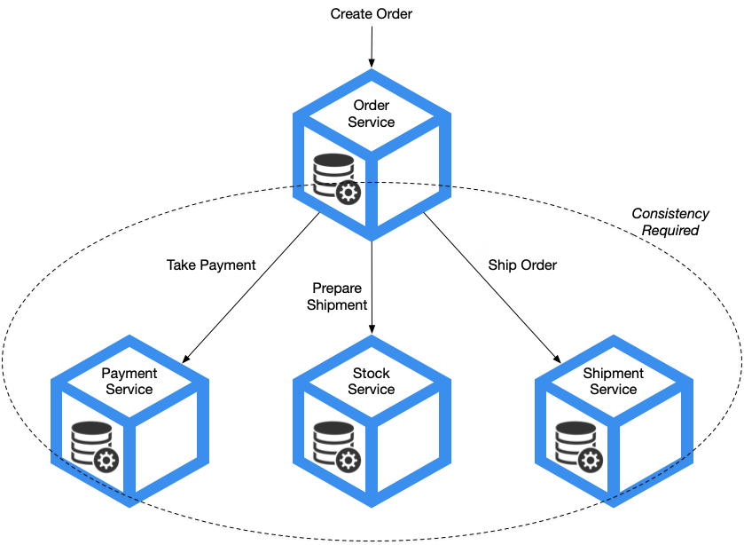
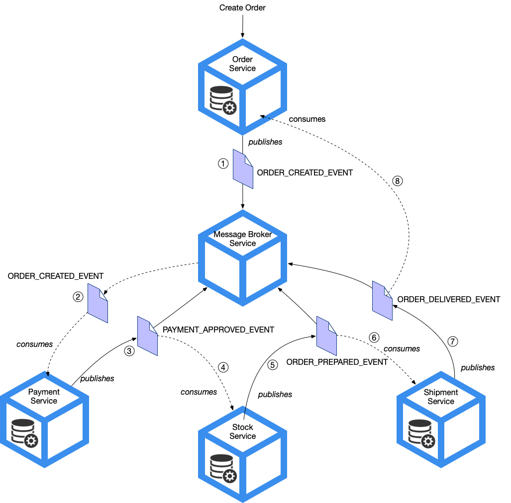
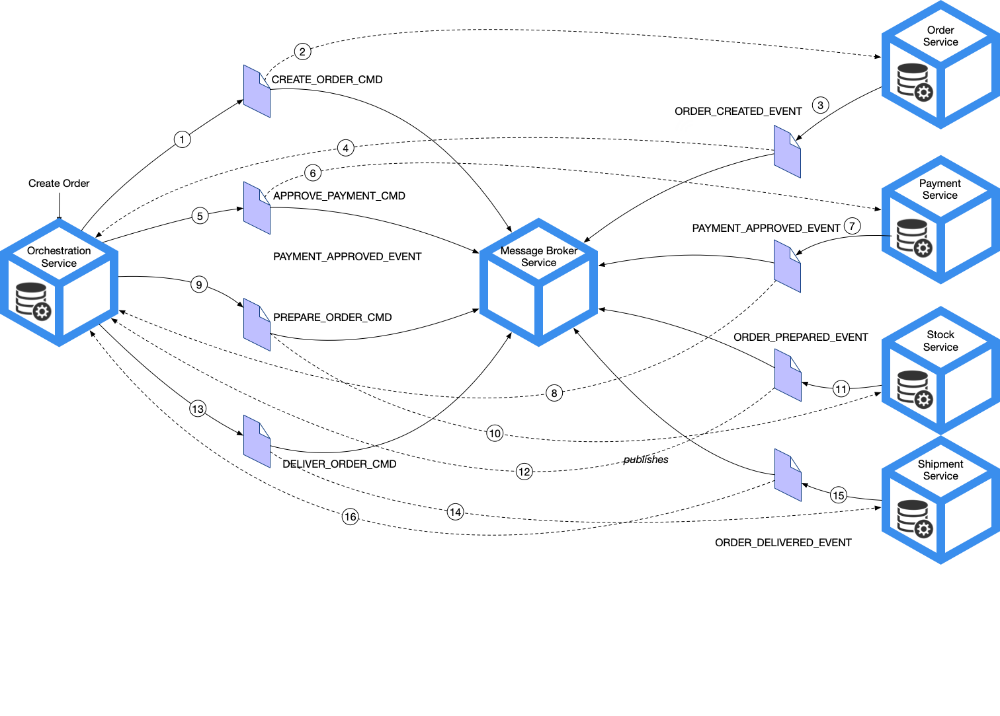

# 2. Business Transactions in a Microservice Architecture

## 2.1 Problem 
The traditional pattern of two-phased commit (2PC) is no longer an option when there is a need to support data consistency in a Microservice-based architecture.

Whilst within the bounded context of a Microservice, ACID (Atomicity, Consistency, Isolation, and Durability) transactionality between microservice code and the state store can generally maintain ACID behaviour through the use of "local" APIs for example JDBC's commit() and rollback() methods. With a Microservice architecture, building a solution that maintains consistency of state across multiple microservices can be challenging as transactions can span multiple services each of which will have their own state store. Such a pattern exists to solve this problem and is called the Saga Pattern. 

Choreography or Orchestration of events across service boundaries can used in order to maintain consistency within a Saga. In choreography, microservices exchange events without no centralised controller, and orchestration uses a central controller to tell each microservice when to perform their operation.

## 2.2 Maintaing Consistency across services

In this use-case in order for an Order to be fulfilled, calls to Payment, Stock and Shipment microservices must be successfully made. Failure of any service will inevitably cause inconsistencies of state across the solution.

### 2.2.1 Using the Saga Pattern to maintain consistency 

The Saga Pattern can maintain data consistency in a microservice architecture without the need for distributed transactions. Relying on the ability for every Microservice being able to maintain coherent and consistent state, the Saga pattern utilises an approach of coordinating each step of the business transaction through asynchronous messaging. Each step of the transaction flow in order to maintain consistency can be mapped to a message exchange between participants of the microservice architecture.

For the Create Order use-case, the Saga must coordinate these local transactions:

1. Order Service - Create an Order in PAYMENT_PENDING state.
2. Payment Service - Authorize payment for Order.
3. Order Service - Update Order to PAYMENT_APPROVED and AWAIT_PICKING state.
4. Stock Service - Prepare Order Items for dispatching.
5. Order Service - Update Order to ITEMS_PICKED state.
6. Shipment Service - Create Delivery of Order.
7. Order Service - Update Order to ORDER_SHIPPED state.

This is a simplistic view of a somewhat complex business transaction that could exist. Many interactions that occur in the real world are very much asynchronous in nature and are what we would term Business Events and critical to our systems in order to maintain coherent state between the digital world and the physical. 

The Saga pattern relies on need for your Microservices to support compensating transaction in order to rollback any changes that may occur in the event of failure of local transaction. E.g. Payment Service support for Refund Payment. In a negative path scenario for example, failure to Prepare Shipment for whatever reason will necessitate the need to perform a Refund after payment was taken.

It is the Saga coordination mechanism that is responsible to ensure that all local transactions are executed in the correct order and any compensation transactions are enacted for negative paths consequences.

There are a couple of different ways to coordinating transactions using a Saga:

1. Choreography - The coordination is distributed by microservices exchanging events. 
2. Orchestration - The coordination is maintained centrally and command messages are issued to each microservice to enact local transactions.

### 2.2.2 Choreography-based Saga

Choreography requires a reliable message delivery capability to ensure state consistency between microservices.

The benefits of using the Choreography-based saga is in its simplicity allowing for loose-coupling of participants through the use of publish-subscribe messaging patterns for event-driven architectures. 

> TIBCO has been at the forefront of messaging and event-driven architectures for many decades

Whilst choreography-based sagas are simple, they come with drawbacks such as inability to detect breakdowns in the choreography of events and difficulty to understand at any one time what state the system is in.

### 2.2.3 Orchestration-based Saga

Orchestration-base saga uses a centralised orchestration component to coordinate with microservice participants using asynchronous reply patterns. Like a real orchestra, the orchestration component acts like a conductor telling every band member when to play.

The orchestration component maintains state and overcomes the issues that the choreography-based faces, namely ability to know what state the system is in. 

The ability to keep and maintain state of for example an Order is very important as it avoids certain anomalies that is caused by the lack of isolation (Sagas are ACD not ACID). These anomalies are caused by the lack of isolation that microservice-based architectures introduce due to need to perform concurrent distributed business transactions across bounded contexts and lay rise to possible lost updates, dirty or fuzzy reads.

    
## 2.3 What's Next ##

[Building a Orchestration-based Saga using TIBCO Cloud™ Platform](002.md)

