# 3. Building a Orchestration-based Saga using TIBCO Cloud™ Platform

In this section, you'll build the main orchestration-based saga component using TIBCO Cloud™ Events Studio, configure TIBCO Cloud Messaging. 

After this section you'll deploy pre-built microservices to TIBCO Cloud that will allow you to test the solution.

## 3.1 Lab Objectives

In this lab, you will create and deploy a TIBCO Cloud™ Events solution that will implement an orchestration-based saga based on a very simple Order use-case:

1. Take Payment - implemented by Payment Microservice
2. Prepare Order - implemented by Stock Microservice
3. Ship Order - implemented by Delivery Microservice

We will have 1 orchestration service and 3 microservices implementing asynchronous command-reply message communication pattern.

The orchestration service will be built using TIBCO Cloud Events and the 3 microservice participants will be built using TIBCO BusinessWorks. TIBCO Cloud™ Messaging will be used for the reliable messaging layer.

--

## 3.2 Getting Started with TIBCO Cloud™ Events Studio - Create Project

Let's start, open TIBCO Cloud™ Events Studio and create a new Workspace, your screen should look similar to this:

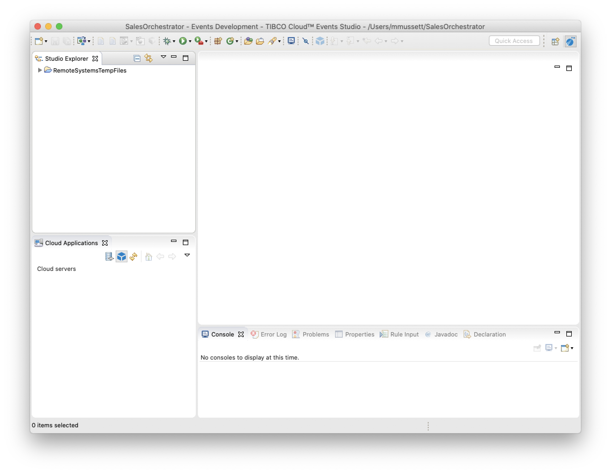

#### 3.2.1 Create a New Studio Project

1. Right click in the Studio Explorer view, select New->Studio Project...

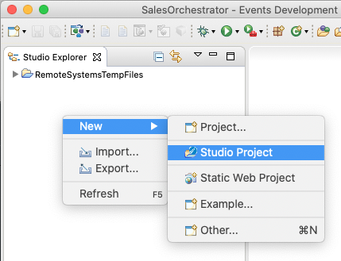

2. A dialog box will appear to create a new Studio Project. Enter 'SalesOrderOrchestrator' in the Project name field and click 'Finish' button.

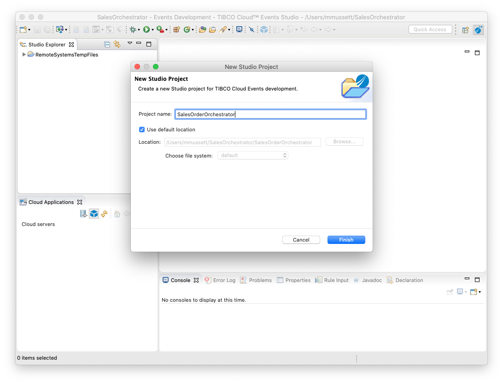

3. Expand the Project list within the Studio Explorer view to show your newly created project...

--

### 3.3 Create Concept Definitions

Within TIBCO Cloud Events, a Concept definition is used to define objects and their properties. Concepts are similar to object-oriented concept of a class in that they represent class-level information. At runtime the instance of a concept are called objects and are persisted in memory or database.

> Further information about Concepts can be found on our on-line documentation [here](https://events.cloud.tibco.com/docs/tce/GUID-2706E8B9-5BD8-49D2-9FD2-F1CF847C4D95.html)

For our use-case we are going to create 4 concepts:

* Order - holds the Order properties (Order ID , Customer ID, email, and Order State)
* Order Item - holds the Order Items (Item Unit Price, Quantity Ordered, Line Price)
* Shipping Address - holds the Order Shipping properties (Address Lines, City, Country, and Postcode)
* InFlightOrders - tracks Orders ID

#### 3.3.1 Create Shipping Address Concept

1. Right click in the Studio Explorer view, select New->Concept...

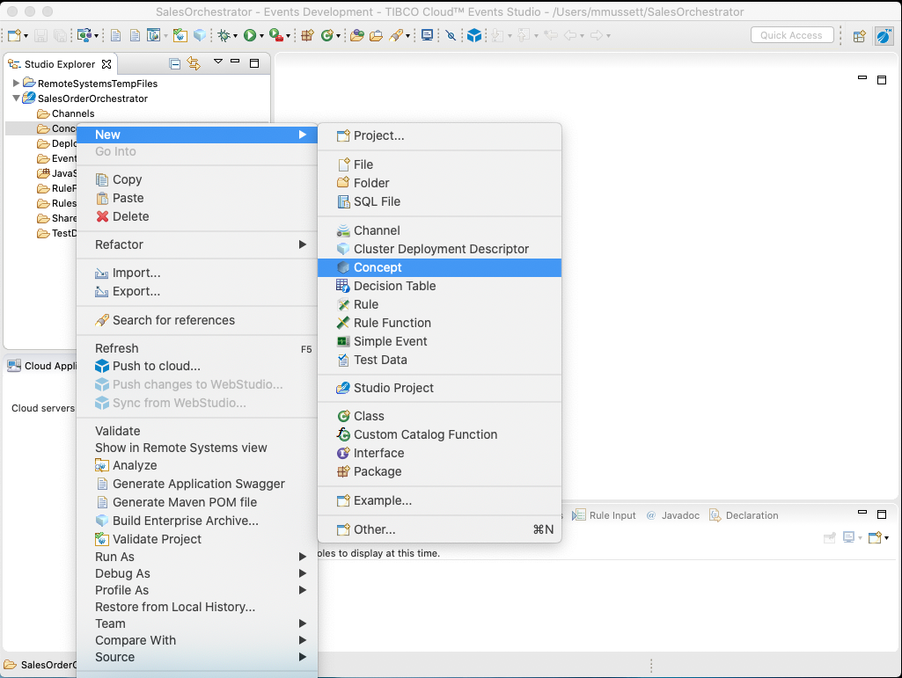

2.	A dialog box will appear for you to create a new concept. 
3. Enter 'ShippingAddress' in the concept name field 
4. Click 'Finish' button.

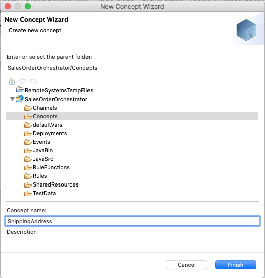

Your screen should look similar to this:

3.	Using the Concept Properties editor, click + and add the following 5 properties:

* address1 - Type=String
* address2 - Type=String
* city - Type=String
* country - Type=String
* postcode - Type=String

Click 'Save' icon on the toolbar.

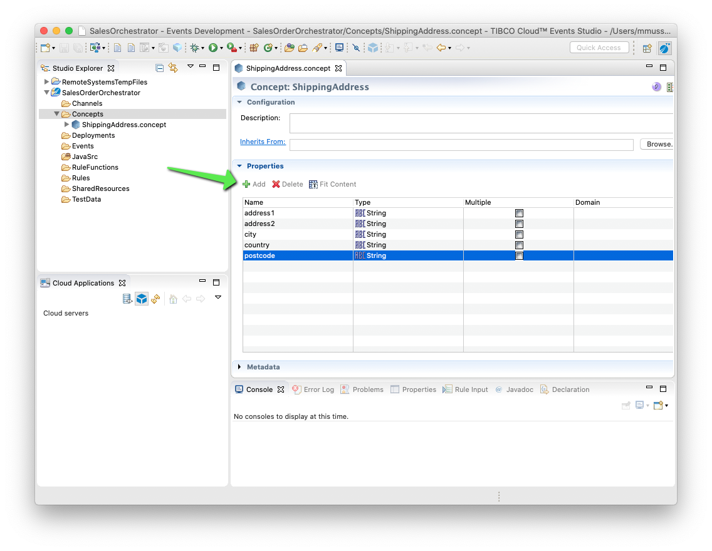

#### 3.3.2 Create Order Item Concept

Now that you've created your first concept, go ahead and create Order Item concept. This time use 'OrderItem' as the Concept name.

Add the following 3 properties to the Order Item concept:

* item_name - Type=String
* price - Type=double
* quantity - Type=int

Your Order Item concept should look like this:

Click 'Save' icon on the toolbar.

#### 3.3.3 Create In-Flight Order Concept

You should be a 'dab-hand' now at creating concepts, go ahead and create In-flight Order Concept. This time use 'InFlightOrders' as the Concept name.

Add the following property to the In-Flight Order concept:

* order_id - Type=String

Your In-Flight Order Concept should look like this:

Click 'Save' icon on the toolbar.

#### 3.3.4 Create Order Concept

We've left the Order Concept to last, this is because we're going to reference Order Item and Shipping Address concepts as properties of the Order concept. Go ahead and create Order Concept. This time use 'Orders' as the Concept name.

Add the following property to the In-Flight Order Concept:

* order_id - Type=String
* customer_id - Type=String
* email - Type=String
* items - Type=ContainedConcept, Resource=OrderItem, Multiple=enabled
* address - Type=ContainedConcept, Resource=ShippingAddress

Your Order Concept should look like this:

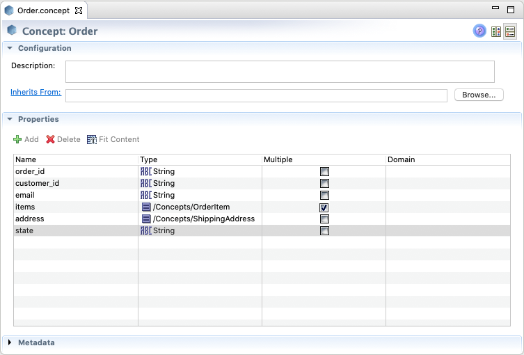

Click 'Save' icon on the toolbar.

--

### 3.4 Create Connection Shared Resource Definitions

We need to get data in and out of TIBCO Cloud Events, to do this we need to create two connections:

* HTTP Connection - this will be used by TIBCO Cloud Events to receive the initial Order JSON request.
* TCM Connection - this will be used by TIBCO Cloud Events to send & receive asynchronous messages with.

Shared Resources can be created in TIBCO Cloud Events and used by components of the solution. Shared Resources configure the connection and contain properties such as host address, url, or passwords.

> Further information about Shared Resources can be found on our on-line documentation [here](https://events.cloud.tibco.com/docs/tce/GUID-2706E8B9-5BD8-49D2-9FD2-F1CF847C4D95.html)

#### 3.4.1 Create HTTP Connection

1. Right click in the Studio Explorer view, select New->Other...
2. Enter 'HTTP' in the Wizards field, click 'Next >' button.

3. Select 'SharedResources' folder. 
4. Enter 'HTTPConnection' in the Filename field, click 'Finish'.

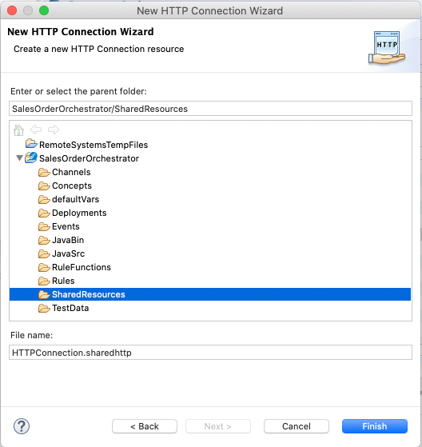

Your screen should be similar to this:

5. Enter 'localhost' in the Host field in the HTTP Connection view.
6. Enter '9091' in the Port field in the HTTP Connection view.
7. Click 'Save' icon on the toolbar.

Your screen should be similar to this:

> Further information about TCM Shared Resources can be found on our on-line documentation [here](https://events.cloud.tibco.com/docs/tce/GUID-5BF3E5F9-B5C2-48A2-ADC3-747C66B65DA8.html)

#### 3.4.2 Create TCM Connection

> You'll need the TIBCO Cloud Messaging URL and Authentication Key that you saved earlier from [Create TCM Authentication Key](000.md)

1. Right click in the Studio Explorer view, select New->Other...
2. Enter 'TCM' in the Wizards field, click 'Next >' button.

3. Select 'SharedResources' folder. 
4. Enter 'TCMConnection' in the Filename field, click 'Finish'.

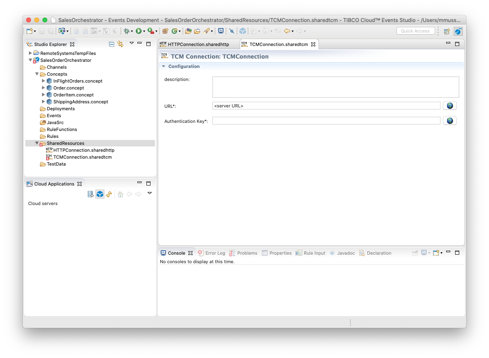

5. Paste in the TCM URL (make sure to over-write what's there) in the URL field in the TCM Connection view.
6. Paste in the TCM Authentication Key in the Authentication Key field in the TCM Connection view.
7. Click 'Save' icon on the toolbar.

Your screen should be similar to this:

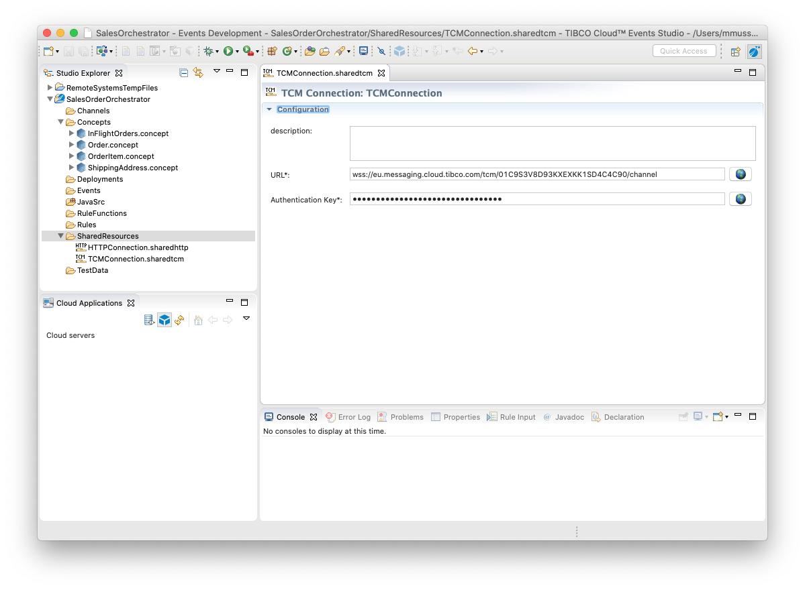

> Further information about TCM Shared Resources can be found on our on-line documentation [here](https://events.cloud.tibco.com/docs/tce/GUID-9E14A523-2222-4577-84F2-7A5082DBC2AF.html)

--

### 3.5 Create Channels and Destinations

Channels are the messaging transport where events enter or exit TIBCO Cloud Events. A channel uses connection resource.

A channel may have one or more destination, which represents a source of messages from that connection resource as well as a sink of messages that are to be sent to the outside.

Whenever we wish to interact with participants either sending or receiving messages we do so through Channels and Destinations.  

> Further information about Channels and Destinations can be found on our on-line documentation [here] https://events.cloud.tibco.com/docs/tce/GUID-D02FBE15-D4AA-415D-B488-DA3CD6CBC46C.html

For our use-case we are going to create 4 channels:

* Order - HTTP Channel used for sending in an Order request.
* Payment - TCM Channel used to communicate with the Payment Microservice using async messaging.
* Stock - TCM Channel used to communicate with the Stock Microservice using async messaging.
* OrderDelivery - TCM Channel used to communicate with the Delivery Microservice using async messaging.

#### 3.5.1 Create Order Channel

1. Right click in the Studio Explorer view, select New->Channel...

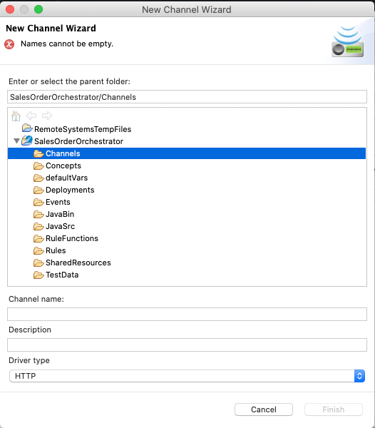

2.	A dialog box will appear for you to create a new channel. Enter 'Order' in the Channel name field, select 'HTTP' as the Driver Type and click 'Finish' button.

Your screen should look similar to this:

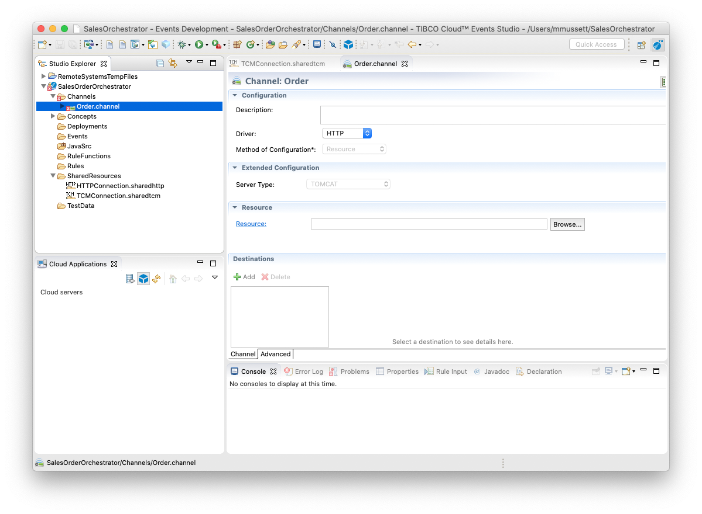

3. Hit the Resource 'Browse...' button, a Select Resource dialog will be shown.
4. Select the HTTPConnection Shared Resource, then click 'OK'.
5. Click 'Save' icon on the toolbar.

---

#### 3.5.2 Create Destination on Order Channel

1. Click '+' in the Destinations panel...

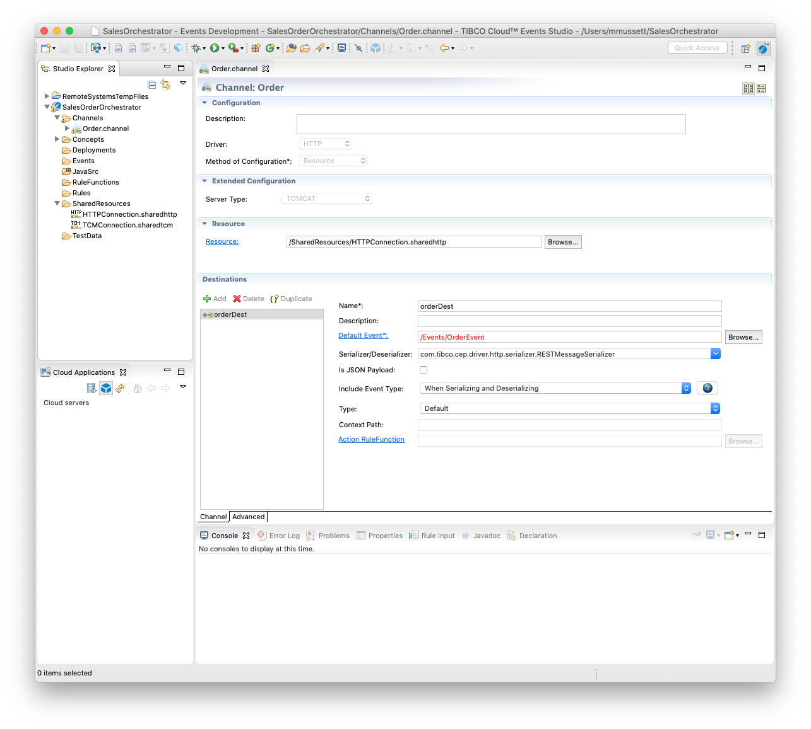

2. A new destination will be created called 'NewDestination_0'. Set the Name field to 'OrderDest'.
3. Set the Default Event to '/Events/OrderEvent'.
3. Click 'Save' icon on the toolbar.

> The Default Event will be red as we have yet to create the event. This will be done at a later step.

Your screen should look similar to this:

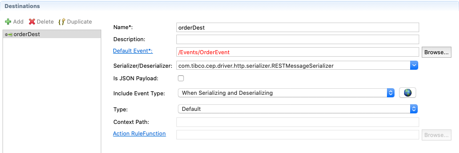

---

#### 3.5.3 Create Payment Channel

1. Right click in the Studio Explorer view, select New->Channel...
2.	A dialog box will appear for you to create a new channel. Enter 'Payment' in the Channel name field, select 'TCM' as the Driver Type and click 'Finish' button.
3. Hit the Resource 'Browse...' button, a Select Resource dialog will be shown.
4. Select the TCMConnection Shared Resource, then click 'OK'.
5. Click 'Save' icon on the toolbar.

---
#### 3.5.4 Create Destinations on Payment Channel

We need 3 destinations for the Payment Channel. Each destination will serve to send or receive asynchronous messages to the Payment microservice over TIBCO Cloud Messaging:

* ExecutePayment - used to send payment request.
* ExecuteRefund - used to send refund of payment request.
* PaymentExecuted - used to receive acknowledgement of payment.

We will use the following destination configurations values:

|Name|Default Event|TCM Destination|Durable Name|Durable Subscription Type|Is JSON Payload|
|---|---|---|---|---|---|
|ExecutePayment|/Events/PaymentEvent|payment||Standard Durable|Yes|
|ExecuteRefund|/Events/RefundEvent|refund||Standard Durable|Yes|
|PaymentExecuted|/Events/PaymentExecutedEvent|paymentexecuted||Standard Durable|Yes|

1. Click '+' in the Destinations panel
3. Configure each field with the correct row information. 
3. Click 'Save' icon on the toolbar.

Repeat the above steps using the information provided in the table to create the 3 destinations.

> The Default Event will be red as we have yet to create the event. This will be done at a later step.

Your screen should look similar to this:

---

#### 3.5.5 Create Stock Channel

1. Right click in the Studio Explorer view, select New->Channel...
2.	A dialog box will appear for you to create a new channel. Enter 'Stock' in the Channel name field, select 'TCM' as the Driver Type and click 'Finish' button.
3. Hit the Resource 'Browse...' button, a Select Resource dialog will be shown.
4. Select the TCMConnection Shared Resource, then click 'OK'.
5. Click 'Save' icon on the toolbar.

---

#### 3.5.4 Create Destinations on Stock Channel

We need 2 destinations for the Stock Channel. Each destination will serve to send or receive asynchronous messages to the Stock microservice over TIBCO Cloud Messaging:

* PrepareOrder - used to send order preparation request.
* OrderPrepared - used to receive acknowledgement that the order has been prepared.

We will use the following destination configurations values:

|Name|Default Event|TCM Destination|Durable Name|Durable Subscription Type|Is JSON Payload|
|---|---|---|---|---|---|
|PrepareOrder|/Events/PrepareOrderEvent|prepare||Standard Durable|Yes|
|OrderPrepared|/Events/OrderPreparedEvent|prepared||Standard Durable|Yes|

1. Click '+' in the Destinations panel
3. Configure each field with the correct row information. 
3. Click 'Save' icon on the toolbar.

Repeat the above steps using the information provided in the table to create the 2 destinations.

> The Default Event will be red as we have yet to create the event. This will be done at a later step.

Your screen should look similar to this:

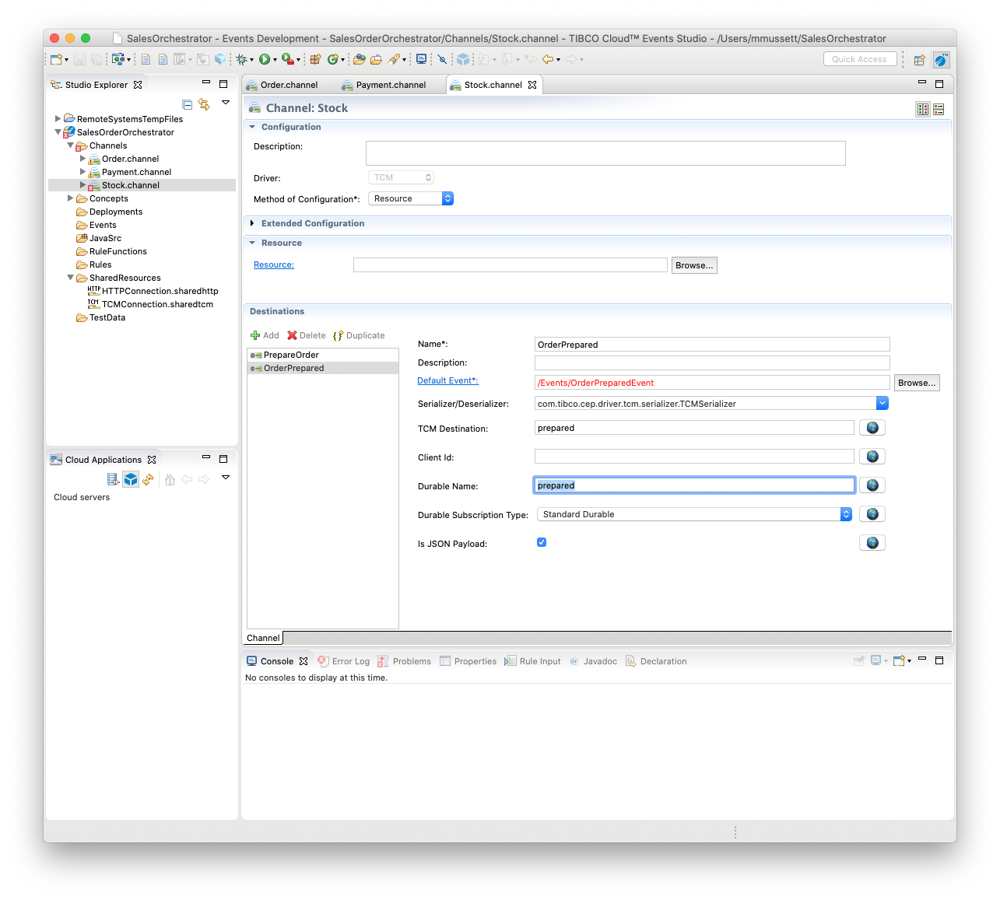

---

#### 3.5.5 Create OrderDelivery Channel

1. Right click in the Studio Explorer view, select New->Channel...
2.	A dialog box will appear for you to create a new channel. Enter 'OrderDelivery' in the Channel name field, select 'TCM' as the Driver Type and click 'Finish' button.
3. Hit the Resource 'Browse...' button, a Select Resource dialog will be shown.
4. Select the TCMConnection Shared Resource, then click 'OK'.
5. Click 'Save' icon on the toolbar.

---

#### 3.5.4 Create Destinations on OrderDelivery Channel

We need 2 destinations for the OrderDelivery Channel. Each destination will serve to send or receive asynchronous messages to the Delivery microservice over TIBCO Cloud Messaging:

* DeliverOrder - used to send order delivery request.
* OrderDelivered - used to receive acknowledgement that the order has been delivered.

We will use the following destination configurations values:

|Name|Default Event|TCM Destination|Durable Name|Durable Subscription Type|Is JSON Payload|
|---|---|---|---|---|---|
|DeliverOrder|/Events/DeliverOrderEvent|deliver||Standard Durable|Yes|
|OrderDelivered|/Events/OrderDeliveredEvent|delivered||Standard Durable|Yes|

1. Click '+' in the Destinations panel
3. Configure each field with the correct row information. 
3. Click 'Save' icon on the toolbar.

Repeat the above steps using the information provided in the table to create the 2 destinations.

> The Default Event will be red as we have yet to create the event. This will be done at a later step.

Your screen should look similar to this:

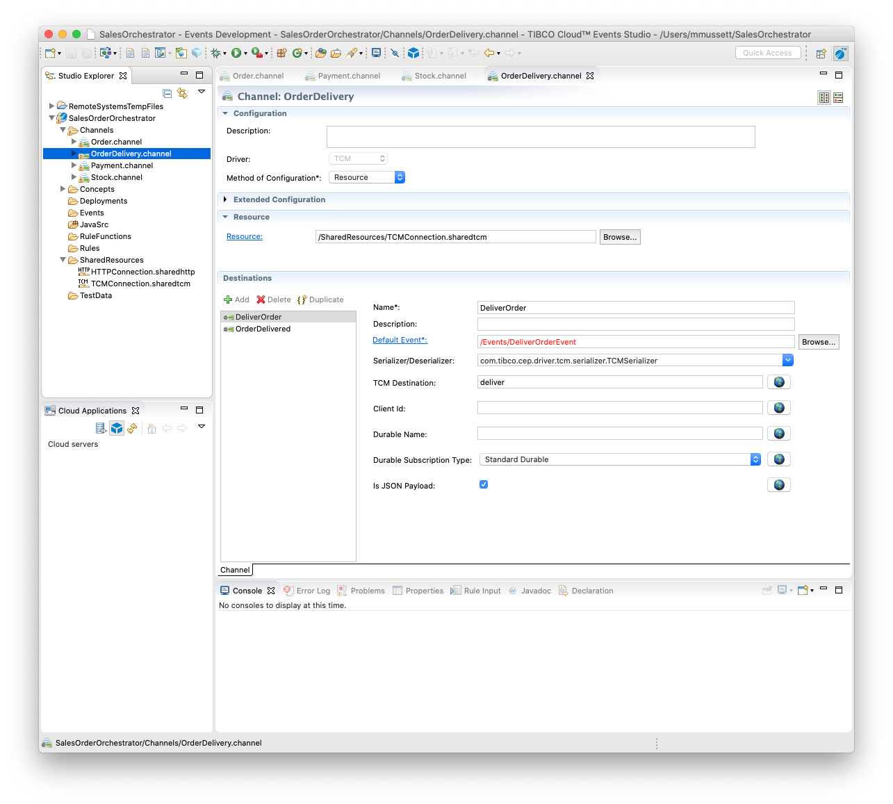

--

### 3.5 Create Events

An event is an object representing some occurence or point of time. In our use-case events represent business activities such as Take Order Payment or Deliver Order. When messages arrive on channel destinations we assign these messages to events. Channel destinations either emit or consume events from external participants.

Events model state similar to concept properties.

> Further information about Events can be found on our on-line documentation [here] https://events.cloud.tibco.com/docs/tce/GUID-FEE4D69B-177F-4A2A-9AB8-56754333F2BF.html

For our use-case we are going to create 9 events which represent the following interactions:

* OrderEvent - A new Order arriving.
* ReplyOrderEvent - Acknowledgement for a new Order.
* PaymentEvent - A payment for an Order is needed.
* RefundEvent - A refund on an Order is needed.
* PaymentExecuteEvent - Payment confirmation for an Order.
* PrepareOrderEvent - Prepare Order for shipment.
* OrderedPreparedEvent - An Order is ready for shipment.
* DeliverOrderEvent - Dispatch Order to the customer.
* OrderDeliveredEvent - An Order has been delivered to the customer.

#### 3.5.1 Create OrderEvent Event

1. Right click in the Studio Explorer view, select New->Simple Event...
2.	A dialog box will appear for you to create a new Simple Event. Select 'Events' folder.
3. Enter 'OrderEvent' in the Simple Event name field.
4. Click 'Finish' button.

Your screen should look similar to this:

5. Click 'Browse...' button for Default Destination. A dialog box will appear for you to select a Channel Destination. Select the 'OrderDest' destination on the 'Order' channel and click 'OK' button.

Your screen should look similar to this:

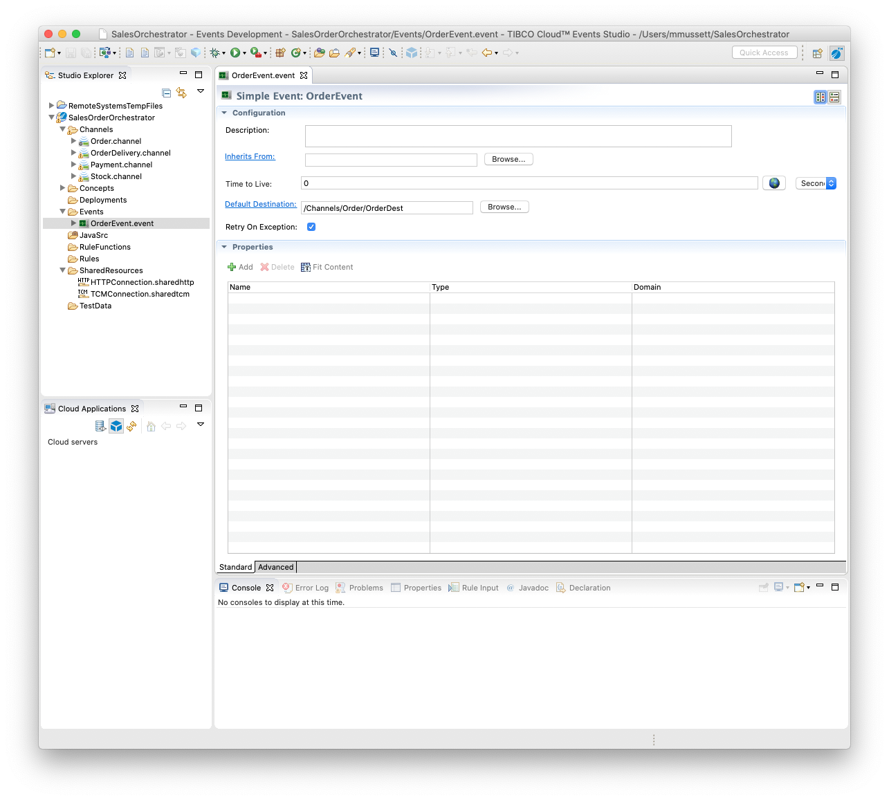

6. Click the 'Advanced' tab on the Properties section.
7. Click the '+' symbol in the 'Payload' section... 

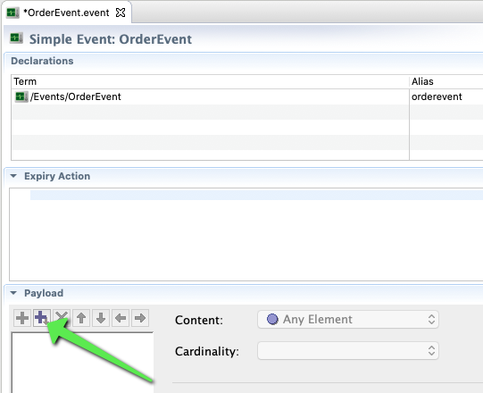

> By clicking the '+', we've added a Complex Element object to the payload. You can model hierarchical structured data model using this tool. Internally TCE object models are stored as XML Schemas. However, we've already got a concept model we can use that we created earler.

8. Click the 'Content' dropdown arrow and select 'XML Element Reference'...
9. Click the binocular icon next to the 'Schema' box... 

10. A 'Select a Resource...' dialog box will be shown. Navigate the Concepts folder and select the 'Order' concept. 

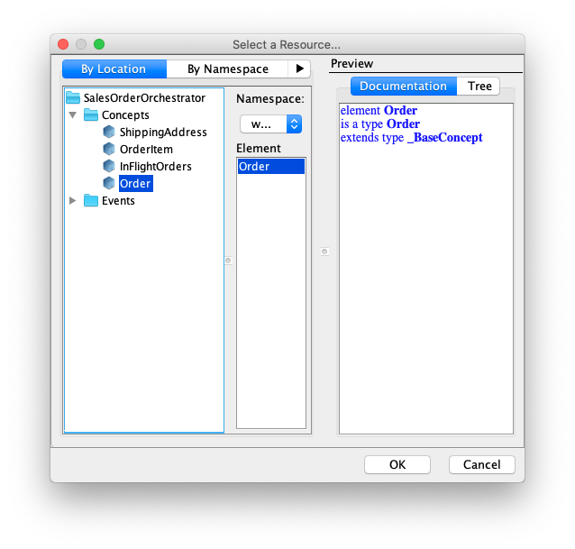

11. Click 'OK'.
12. Click 'Save' icon on the toolbar.

Your screen should look similar to this:

#### 3.5.2 Create ReplyOrderEvent Event

1. Right click in the Studio Explorer view, select New->Simple Event...
2.	A dialog box will appear for you to create a new Simple Event. Select 'Events' folder.
3. Enter 'ReplyOrderEvent' in the Simple Event name field.
4. Click 'Finish' button.
5. Click 'Browse...' button for Default Destination. A dialog box will appear for you to select a Channel Destination. Select the 'OrderDest' destination on the 'Order' channel and click 'OK' button.
5. Click the 'Advanced' tab on the Properties section.
6. Click the '+' symbol in the 'Payload' section.
7. Click the '+' symbol again.
8. Select 'root' Complex Element Content and change the Name field from 'root' to 'response'.
9. Select 'param' Element and change the Name field from 'param' to 'status'.
10. Click 'Save' icon on the toolbar.

Your screen should look similar to this:

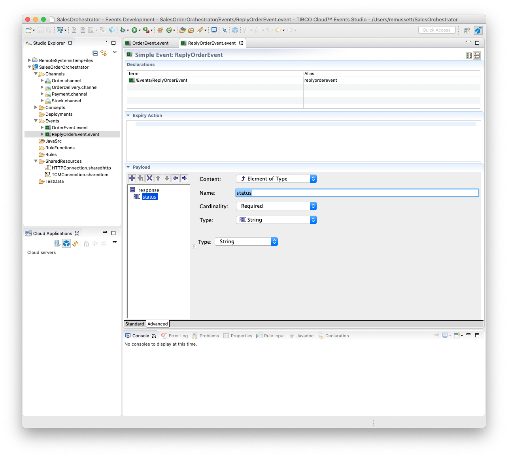

#### 3.5.3 Create PaymentEvent Event

1. Follow the steps 1-10 above but create the Simple Event named 'PaymentEvent' and set the Default Destination set to 'Payment' channel and 'ExecutePayment' destination.
2. On the 'Advanced' tab, create the Properties structure with a Complex element named 'payload' and 4 child elements named:

* order_id - Content=Element of Type String
* customer_id - Content=Element of Type String
* email - Content=Element of Type String
* amount - Content=Element of Type String

The Payload properties should look like this:

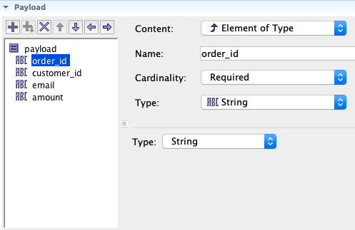

#### 3.5.4 Create PaymentExecutedEvent Event

1. Create the Simple Event named 'PaymentExecuteEvent' and set the Default Destination set to 'Payment' channel and 'PaymentExecuted' destination.
2. On the 'Advanced' tab, create the Properties structure with a Complex element named 'payload' and 3 child elements named:

* order_id - Content=Element of Type String
* customer_id - Content=Element of Type String
* status - Content=Element of Type String

The Payload properties should look like this:

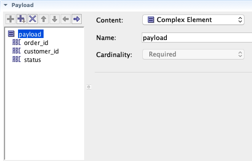

#### 3.5.5 Create RefundEvent Event

1. Create the Simple Event named 'RefundEvent' and the Default Destination set to 'Payment' channel and 'ExecuteRefund' destination.
2. On the 'Advanced' tab, create the Properties structure with a Complex element named 'payload' and 4 child elements named:

* order_id - Content=Element of Type String
* customer_id - Content Element of Type String
* email - Content=Element of Type String
* amount - Content=Element of Type String

The Payload properties should look like this:

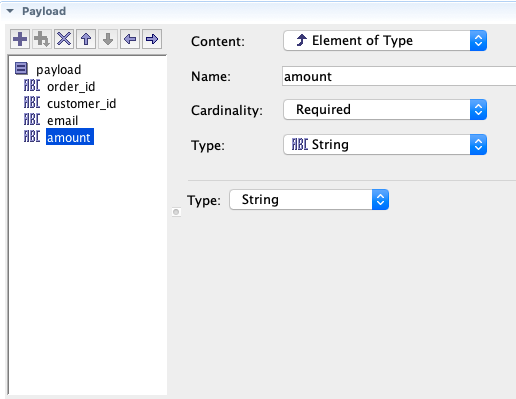

#### 3.5.6 Create PrepareOrderEvent Event

1. Create the Simple Event named 'PrepareOrderEvent' and the Default Destination set to 'Stock' channel and 'PrepareOrder' destination.
2. On the 'Advanced' tab, create the Properties structure with a XML Element Reference to the 'Order' Concept.

The Payload properties should look like this:

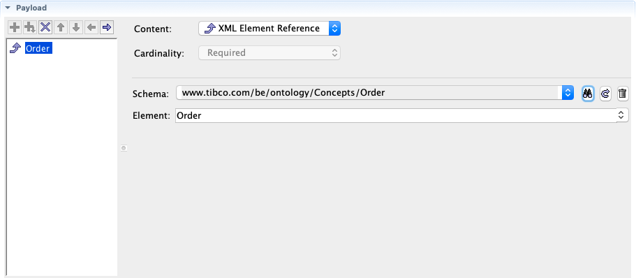

#### 3.5.7 Create OrderedPreparedEvent Event

1. Create the Simple Event named 'OrderPreparedEvent' and the Default Destination set to 'Stock' channel and 'OrderPrepared' destination.
2. On the 'Advanced' tab, create the Properties structure with a Complex element named 'payload' and 3 child elements named:

* order_id - Content=Element of Type String
* customer_id - Content=Element of Type String
* status - Content=Element of Type String

The Payload properties should look like this:

#### 3.5.8 Create DeliverOrderEvent Event

1. Create the Simple Event named 'DeliverOrderEvent' and the Default Destination set to 'OrderDelivery' channel and 'DeliverOrder' destination.
2. On the 'Advanced' tab, create the Properties structure with a Complex element named 'payload' and 4 child elements named:

* order_id - Element of Type=String
* customer_id - Element of Type=String
* email - Element of Type=String
* ShippingAddress - XML Element Reference=Concepts/ShippingAddress

The Payload properties should look like this:

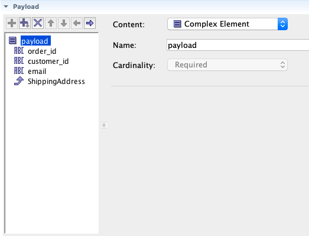

#### 3.5.9 Create OrderDeliveredEvent Event

1. Create the Simple Event named 'OrderDeliveredEvent' and the Default Destination set to 'OrderDelivery' channel and 'OrderDelivered' destination.
2. On the 'Advanced' tab, create the Properties structure with a Complex element named 'payload' and 3 child elements named:

* order_id - Content=Element of Type String
* customer_id - Content=Element of Type String
* status - Content=Element of Type String

The Payload properties should look like this:

--

### 3.6 Create Rules & Rule Functions

Rules are the logic behind the events. Rules are executed whenever an Event is created or modified within TIBCO Cloud Events. Rules allow us to codify our business logic using Java. We use Rules and Events to determine the next action to take. The TIBCO Cloud Events engine will determine which rules to execute based on predicated logic e.g. Payment=APPROVED AND Order Status=PREPARED 

> Don't worry if you do not know Java programming, we've pre-prepared all the Rule logic for you :-)

> Further information about Rules can be found on our on-line documentation [here](https://events.cloud.tibco.com/docs/tce/GUID-42CEA3E9-33E2-4E15-834D-C1720AB59526.html)

#### 3.6.1 Create OrderPrepProcessor Rule Function

1. Right click in the Studio Explorer view, select New->Rule Function...
2.	A dialog box will appear for you to create a new Rule Function. Select 'RuleFunctions' folder.
3. Enter 'OrderPreProcessor' in the Rule Function name field.
4. Click 'Finish' button.
5. Paste the contents of the OrderPreProcessor.rulefunction text file located in src/TCE/SalesOrderOrchestrator/RuleFunctions github repository.
6. Click 'Save' icon on the toolbar.

> The OrderPrepProcessor is executed when a HTTP request is sent in to TIBCO Cloud Events on the OrderDest destination of the Order Channel.
> 
> The rule performs the following functionality:
> 
> * Sends HTTP Reply back to the client
> * Determines if an Order Instance already exists and if so consumes the Order Event thus stopping any rules being executed.
> * Creates an InFlightOrder Instance if no Order exists and allows the Order Event to remain in memory for any further Rules to be executed during the RETE cycle. In this case the OrderRule will be executed next.
 

#### 3.6.2 Create CalculateOrderAmount Rule Function

1. Right click in the Studio Explorer view, select New->Rule Function...
2.	A dialog box will appear for you to create a new Rule Function. Select 'RuleFunctions' folder.
3. Enter 'CalculateOrderAmount' in the Rule Function name field.
4. Click 'Finish' button.
5. Paste the contents of the CalculateOrderAmount.rulefunction text file located in src/TCE/SalesOrderOrchestrator/RuleFunctions github repository.
6. Click 'Save' icon on the toolbar.

> The CalculateOrderAmount Rule Function is a function that is called with an Order and it iterates through the Order Items calculating the total amount for the order.
> The Rule Function is called by the OrderRule Rule.
 
#### 3.6.3 Create OrderRule Rule Function

1. Right click in the Studio Explorer view, select New->Rule...
2.	A dialog box will appear for you to create a new Rule. Select 'Rule' folder.
3. Enter 'OrderRule' in the Rule Function name field.
4. Click 'Finish' button.
5. Paste the contents of the OrderRule.rule text file located in src/TCE/SalesOrderOrchestrator/Rule github repository.
6. Click 'Save' icon on the toolbar.

> The OrderRule Rule is executed by TIBCO Cloud Events when an OrderEvent exists.
> 
> The rule performs the following functionality:
> 
> * Calls the CalculateOrderAmount Rule Function.
> * Determines if an Order Instance already exists and if so consumes the Order Event thus stopping any rules being executed.
> * Creates an Order Instance in the TIBCO Cloud Events engines working memory.
> * Creates a PaymentEvent Event to trigger the orchestration of taking payment. The PaymentEvent is published on to TIBCO Cloud Messaging via the Payment Channel.
> * Consumes the OrderEvent so that no further rules are fired for this event.
 
 
#### 3.6.4 Create PaymentExecutedRule Rule Function

1. Right click in the Studio Explorer view, select New->Rule...
2.	A dialog box will appear for you to create a new Rule. Select 'Rule' folder.
3. Enter 'PaymentExecutedRule' in the Rule Function name field.
4. Click 'Finish' button.
5. Paste the contents of the PaymentExecutedRule.rule text file located in src/TCE/SalesOrderOrchestrator/Rule github repository.
6. Click 'Save' icon on the toolbar.

> The PaymentExecutedRule Rule is executed by TIBCO Cloud Events when an PaymentExecutedEvent exists. 
> The PaymentExecutedEvent arrives from TIBCO Cloud Messaging via the PaymentExecuted Destination of the Payment Channel.
> 
> The rule performs the following functionality:
> 
> * Calls the CalculateOrderAmount Rule Function.
> * Determines the status of the Payment and updates the Order instance state.
> * If the Payment was a SUCCESS it creates a PrepareOrderEvent Event to trigger the orchestration of preparing the order. The PrepareOrderEvent is published on to TIBCO Cloud Messaging via the PrepareOrder destination of the Stock Channel.
> * Creates a PrepareOrder Event to trigger the orchestration of preparing the order. The PrepareOrderEvent is published on to TIBCO Cloud Messaging via the Stock Channel.
> * Consumes the PaymentExecutedEvent so that no further rules are fired for this event.
 
 
#### 3.6.5 Create OrderPreparedRule Rule Function

1. Right click in the Studio Explorer view, select New->Rule...
2.	A dialog box will appear for you to create a new Rule. Select 'Rule' folder.
3. Enter 'PaymentExecutedRule' in the Rule Function name field.
4. Click 'Finish' button.
5. Paste the contents of the OrderPreparedRule.rule text file located in src/TCE/SalesOrderOrchestrator/Rule github repository.
6. Click 'Save' icon on the toolbar.

> The OrderPreparedRule Rule is executed by TIBCO Cloud Events when an OrderPreparedEvent exists. 
> The OrderPreparedEvent arrives from TIBCO Cloud Messaging via the OrderPrepared Destination of the Stock Channel.
> 
> The rule performs the following functionality:
> 
> * Calls the CalculateOrderAmount Rule Function.
> * Determines the status of the Prepared Order and updates the Order instance state.
> * If the Prepared Order was a SUCCESS it creates a DeliverOrderEvent Event to trigger the orchestration of delivering the order. The DeliverOrderEvent is published on to TIBCO Cloud Messaging via the DeliverOrder Destination of the OrderDelivery Channel.
> * If the Prepared Order was not a SUCCESS it creates a RefundEvent to trigger the orchestration of refund. The RefundEvent is published on to TIBCO Cloud Messaging via the ExecuteRefund Destination of the Payment channel.
> * Consumes the OrderPreparedEvent so that no further rules are fired for this event.
 
#### 3.6.6 Create OrderDeliveredRule Rule Function

1. Right click in the Studio Explorer view, select New->Rule...
2.	A dialog box will appear for you to create a new Rule. Select 'Rule' folder.
3. Enter 'OrderDeliveredRule' in the Rule Function name field.
4. Click 'Finish' button.
5. Paste the contents of the OrderDeliveredRule.rule text file located in src/TCE/SalesOrderOrchestrator/Rule github repository.
6. Click 'Save' icon on the toolbar.

> The OrderDeliveredRule Rule is executed by TIBCO Cloud Events when an OrderDeliveredEvent exists. 
> The OrderDeliveredEvent arrives from TIBCO Cloud Messaging via the OrderedDelivered Destination of the OrderDelivery Channel.
> 
> The rule performs the following functionality:
> 
> * Calls the CalculateOrderAmount Rule Function.
> * Deletes the Order instance.
> * Consumes the OrderDeliveredEvent so that no further rules are fired for this event.
 

    
## 3.7 What's Next

[Preparing for the deployment of the TIBCO Cloud Events Solution](003.md)

