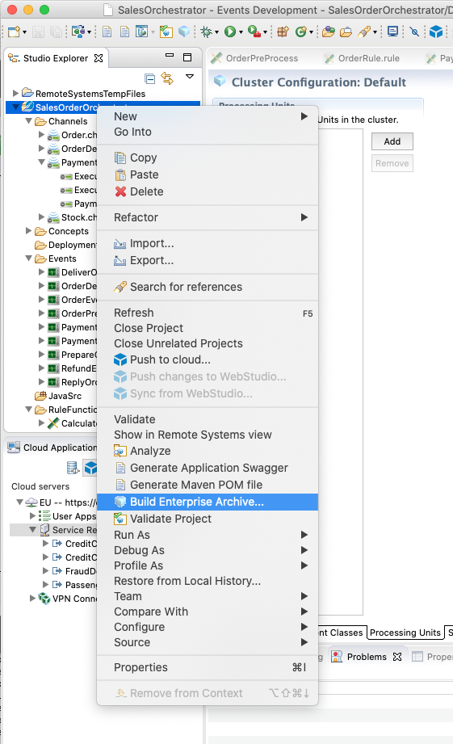
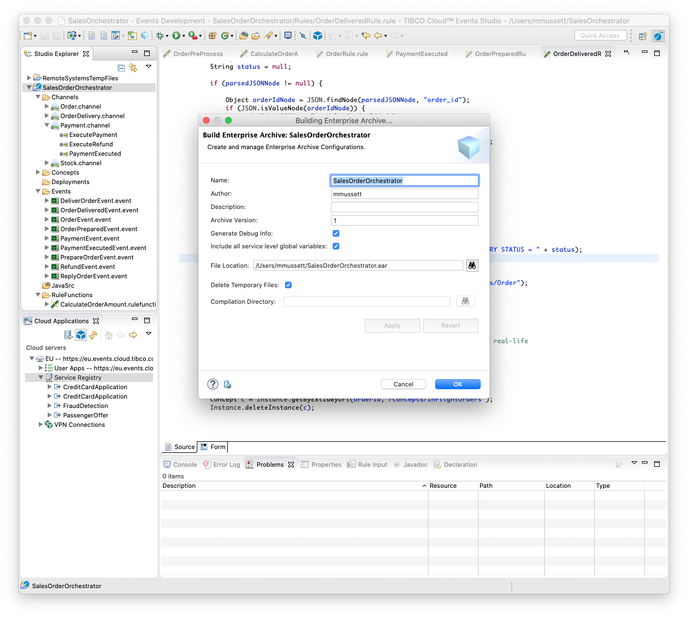
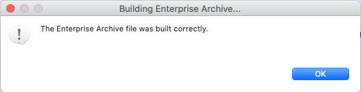
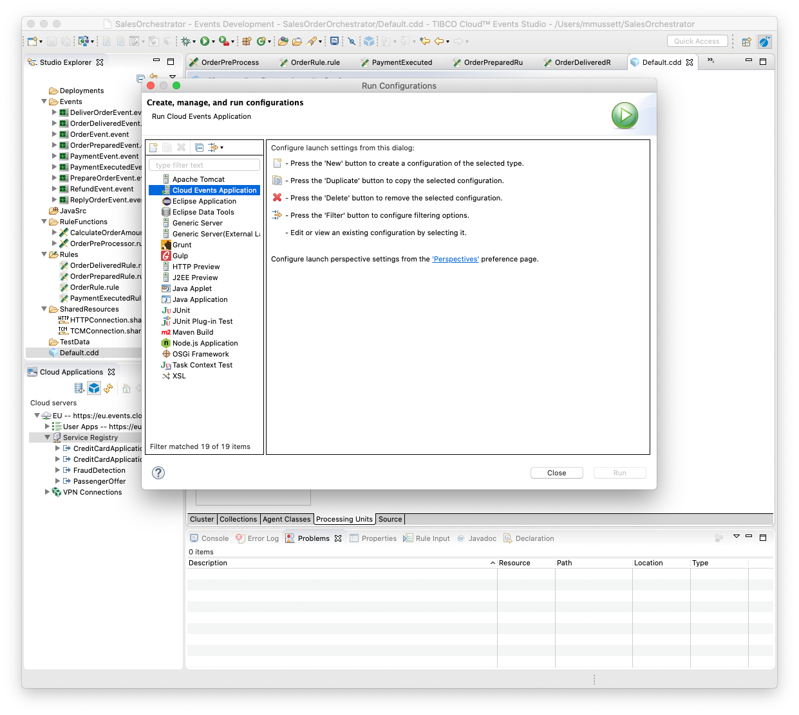
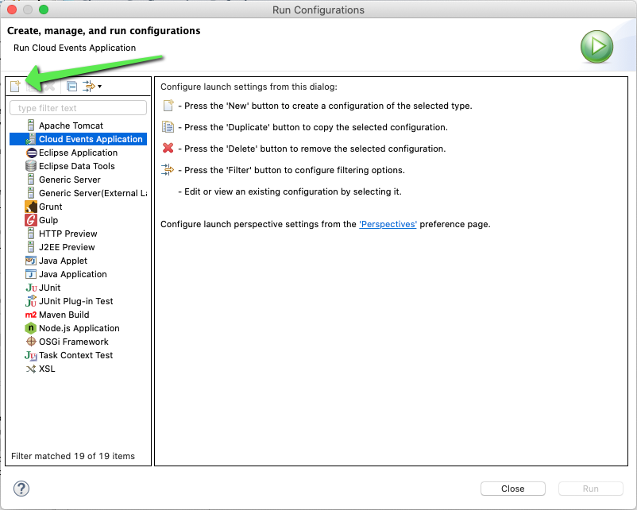
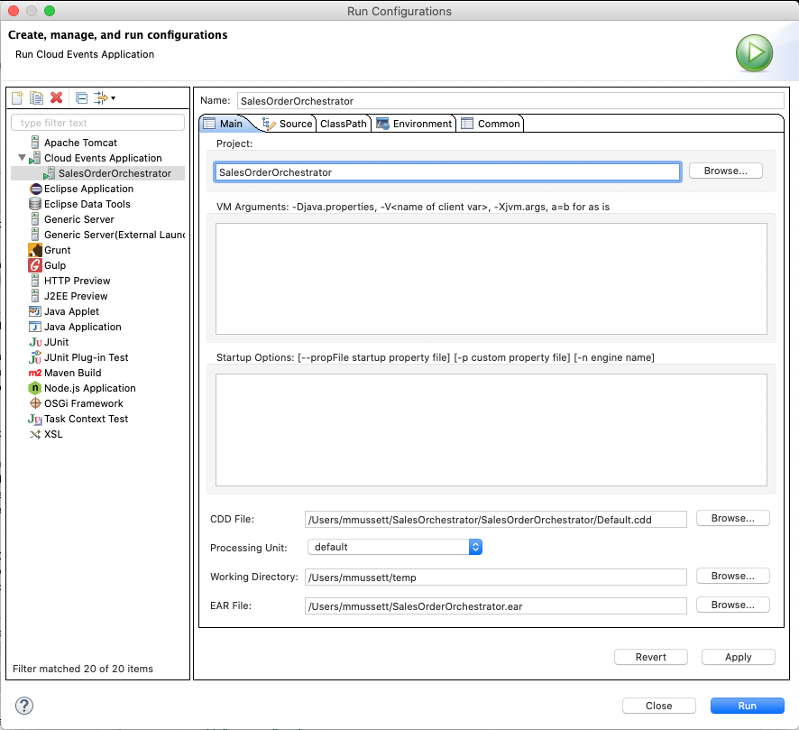
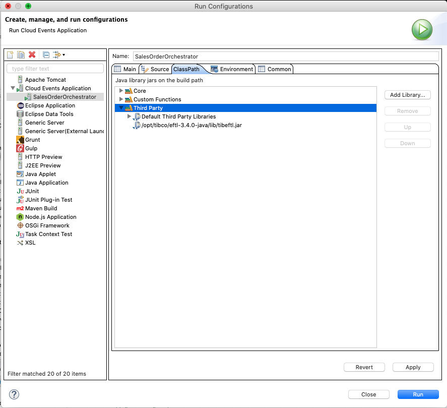

# 4.0 Preparing for the deployment of the TIBCO Cloud Events Solution

## 4.1 Import Cluster Deployment Descriptor

To run the TIBCO Cloud Events project we need to create a Cluster Deployment Descriptor file. 

Luckily for you we've already done this for you and all you need to do is import the file 'Default.cdd' located in src/TCE/SalesOrderOrchestrator folder of the github repository.

You can import directly in to the project by dragging and dropping the Default.cdd file using either your Mac Finder or Windows Explorer.

Eclipse will prompt you how it should import the files into the project, make sure to choose 'Copy Files'.

--

## 4.2 Build Enterprise Archive

1. Right click the SalesOrderOrchestrator project in the Studio Explorer view.
2. Click 'Build Enterprise Archive...' menu item.

3. Set the File Location to where you wish the Enterprise Archive file to be created.

4. Click 'OK'. 

5. Click 'OK'.

--

## 4.3 Create Run Configuration

Create a Run Configuration for the project. 

1. Select the SalesOrderOrchestrator project in the Studio Explorer view.
2. On the application menu, click 'Run->Run Configurations'

Your screen should look similar to this:

2. Click 'Cloud Events Application' in the Run Configurations dialog.
3. Click the 'New Launch Configuration' button...

4. Click 'Browse...' button for the CDD and select 'Default.cdd' file.
5. Select 'Default' for the Processing Unit.
6. Create a temporary working directory on your local filesystem. This will be used by the engine runtime for storage.
7. Click the 'Browse...' button for Working Directory and select the temporary working directory.
8. Click the 'Browse...' button for EAR File and select the EAR file you previously generated.

The Run Configuratipn should look similar to this:

9. Click the ClassPath tab.
10. Select 'Third Party' and click 'Add Library...' button.
11. Navigate to where you extracted the TIBCO Cloud Messaging Java SDK and select the tibeftl.jar file.
 

12. Click 'Apply' button.
13. Click 'Close' button.

    
## 4.4 What's Next

[Build and Deploy Event-Driven Microservices](004.md)

