# 5.0 Build and Deploy Event-Driven Microservices

## 5.1 TIBCO Cloud Messaging

1. Navigate to TIBCO Cloud Messaging Status Page [here](https://eu.messaging.cloud.tibco.com/tcm/ui/)
2. Verify the service is running, if not start it.

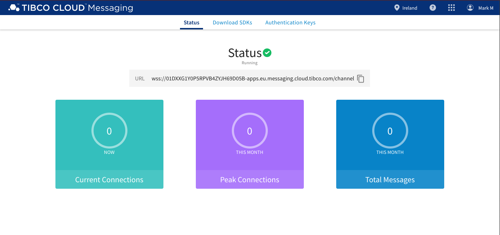

### 5.1.1 TIBCO Cloud Messaging Authentication Keys

1. Navigage to TIBCO Cloud Messaging Authentication Keys Page [here](https://eu.messaging.cloud.tibco.com/tcm/ui/admin)

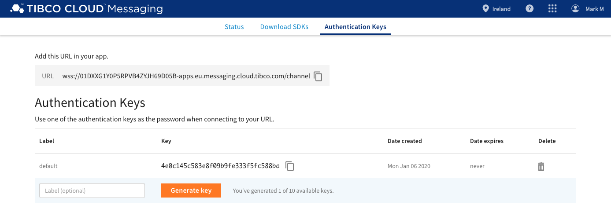

2. Make a note of the URL and pre-created authentication Key labeled 'default'

> URL = wss://01DXXG1Y0P5RPVB4ZYJH69D05B-apps.eu.messaging.cloud.tibco.com/channel
> 
> KEY = 4e0c145c583e8f09b9fe333f5fc588ba

### 5.1.2 Create TIBCO Cloud Messaging Connector

1. Navigate to TIBCO Cloud Integration Connections page [here](https://eu.integration.cloud.tibco.com/wistudio/connectiondetails)

2. Enter 'TIBCO' in the search box and hit the magnifying glass symbol.

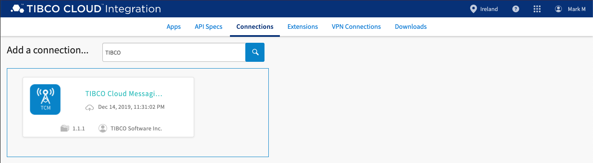

3. Click the 'TIBCO Cloud Messaging Connector'.
4. Paste the TIBCO Cloud Connection URL in to the Connection URL field.
5. Paste the TIBCO Cloud Authentication URL in to the Authentication Key field.
6. Click 'Save'

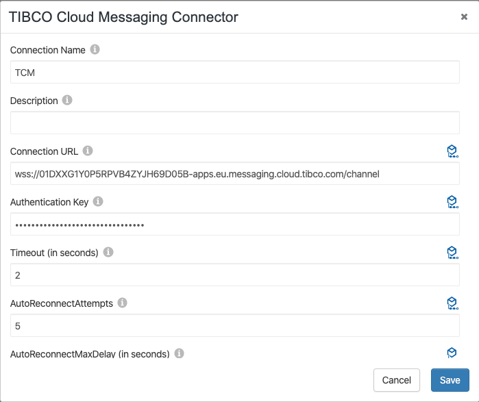

## 5.2 Create TIBCO Flogo Apps

We will be using TIBCO Cloud Integration (TCI) Flogo to build our event-driven Microservices with.

Navigate to TCI Flogo Apps Page [here](https://eu.integration.cloud.tibco.com/applications)

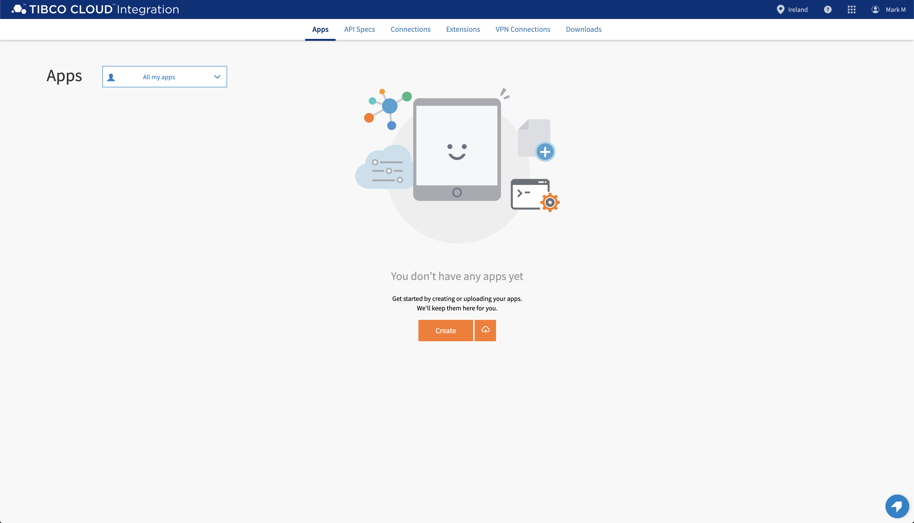

### 5.2.1 Create Payment Microservice

1. Click 'Create' button.
2. Enter 'PaymentService' for the app name.

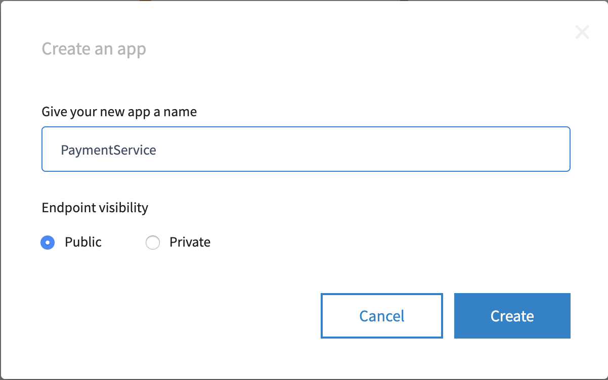

3. Click 'Create' button.
4. Click 'Create a TIBCO Flogo App'.

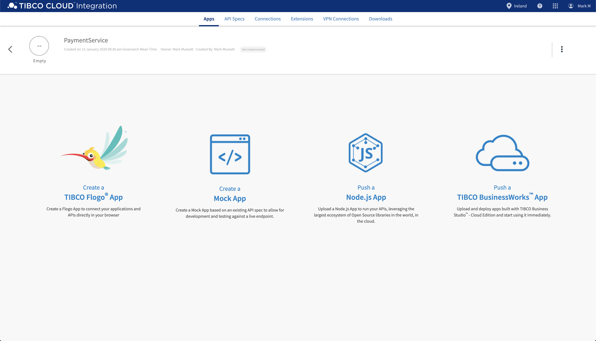

5. Click '+ Create' to create Flogo Flow.

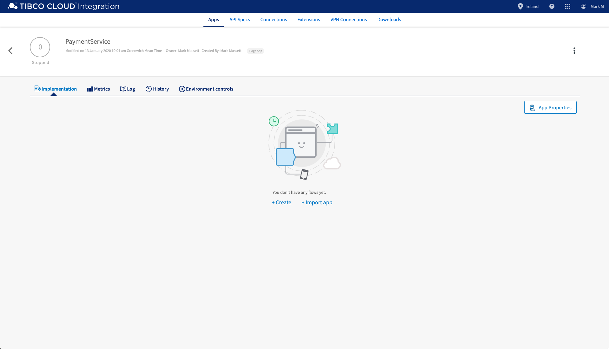

6. Enter 'ExecutePaymentFlow' for the Flow Name and click 'Create' button.

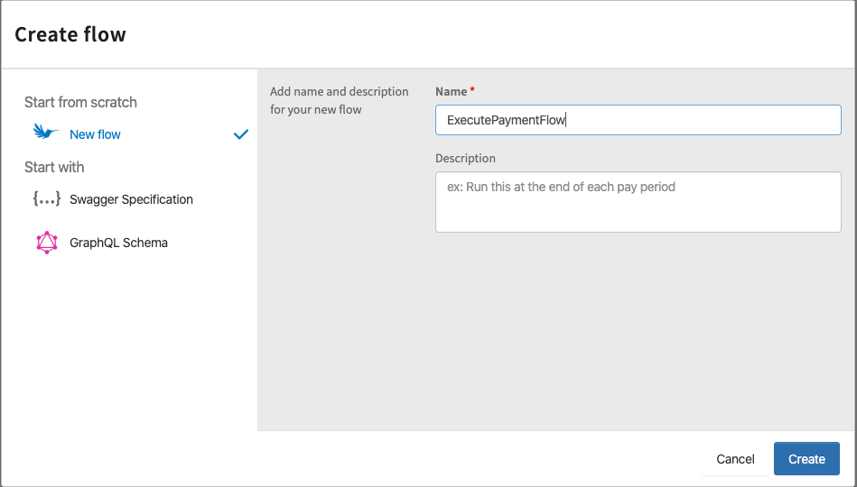

----

#### Trigger Logic


1. Click 'Start with a trigger'.

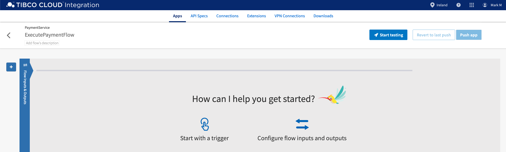

2. Click 'Message Subscriber' trigger.

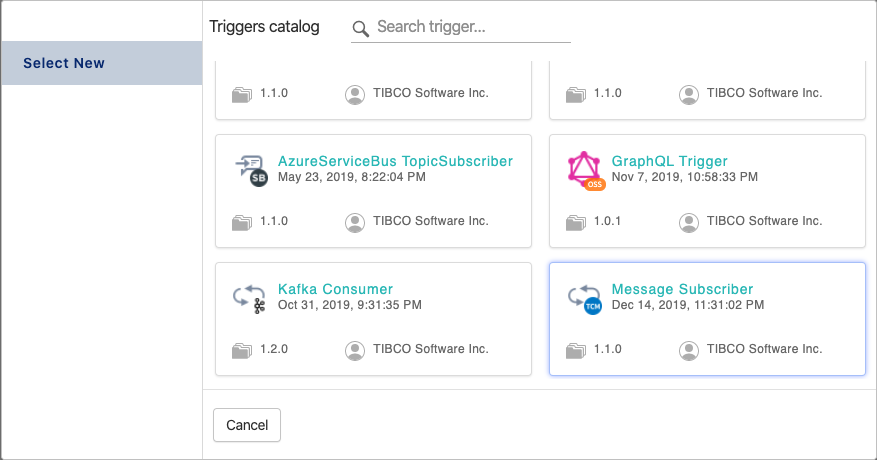

3. Use the Connection dropdown box and choose the TCM Connector you created earlier and click 'Continue' button.

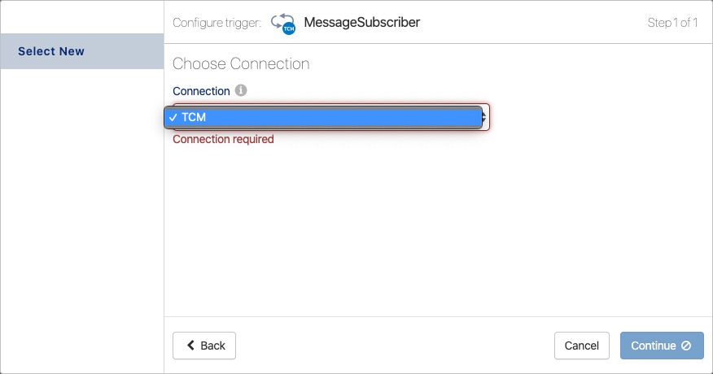

4. Click 'Just add the trigger' button

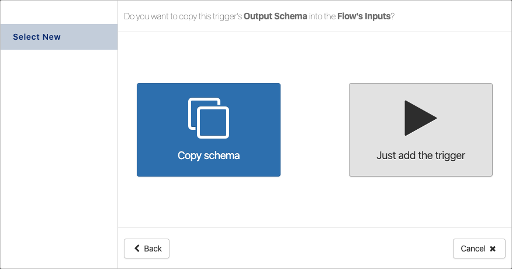

5. Click the TCM trigger symbol

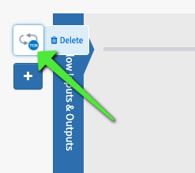

6. Enter 'payment' in to the Destination field.

> This is the TIBCO Cloud destination we will receive messages on.

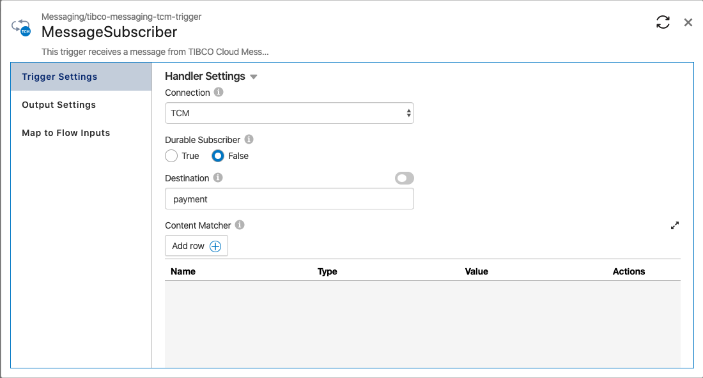

7. Click 'Output Settings' in LHS panel and enter the following JSON in to the Message Schema

```json
{
    "payload": ""
}
```

> The service will receive a JSON message containing a single field called 'payload'.

8. Click the sync flow input and output symbol in the top right corner of the dialog box

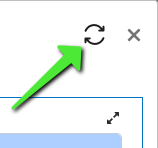

9. Click 'Map to Flow Inputs' in LHS panel. We need to map the Flow Input to the Trigger Output. In the Flow Input pane navigate using the arrows to the payload field (message->payload). In The Trigger Output panel navigate using the arrows to the payload field ($trigger->message->payload). Click the 'payload' field. 

The mapping should look like this...

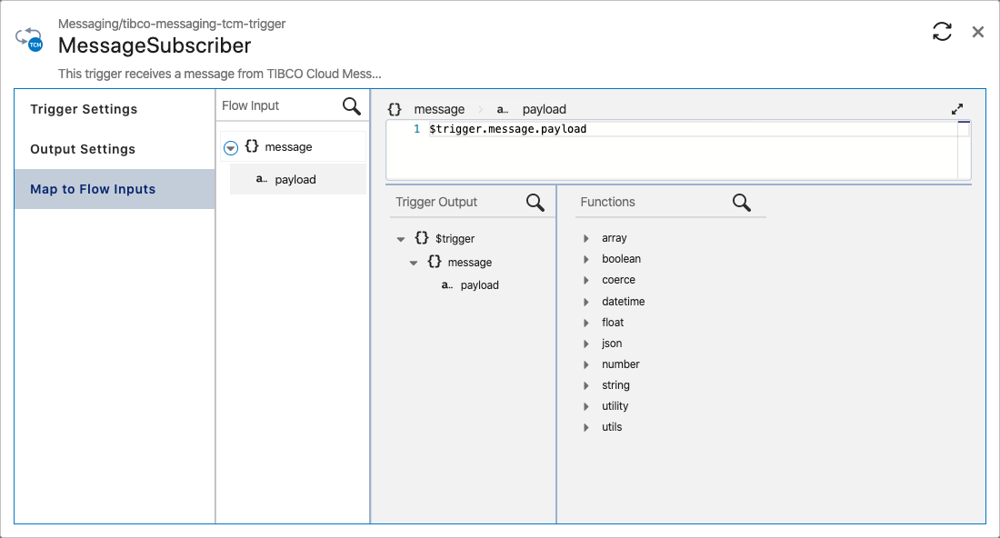

10. Close the Message Subscriber dialog box.

----

#### Flow Logic


We're going to create a flow that looks like this:

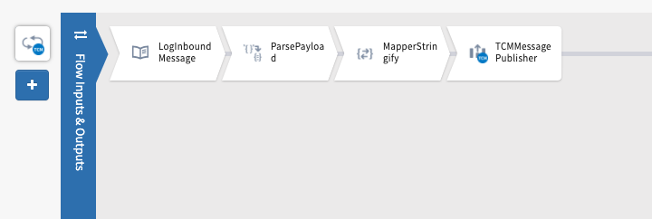


1. Hover over the Activity Line, and click the first free box to add activity. The Add Activity dialog will be show.

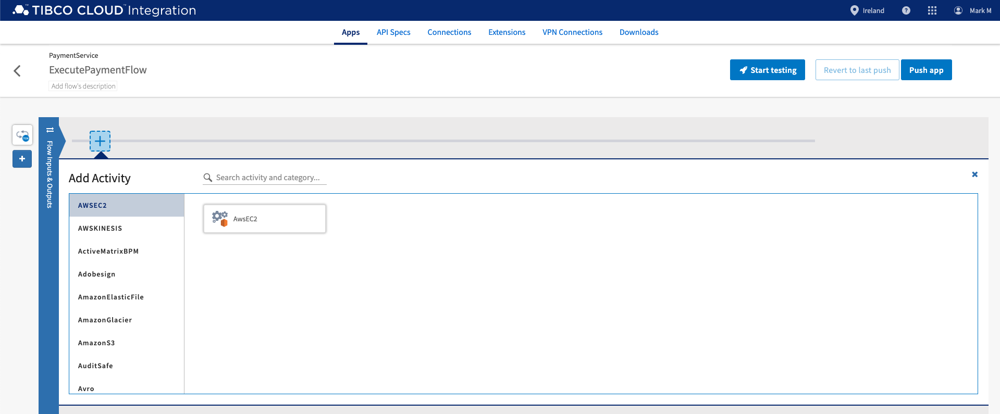

2. In the LHS panel, scroll to 'General' and click. The activities panel will show you the general activities available to place at this step. Go ahead and click 'Log Message'

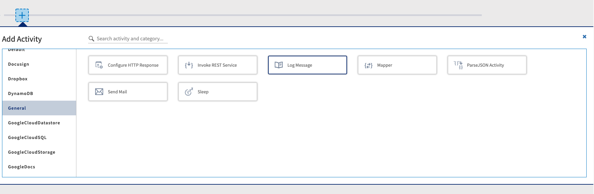

3. Click the 'LogMessage' activity title field and rename to 'LogInboundMessage'

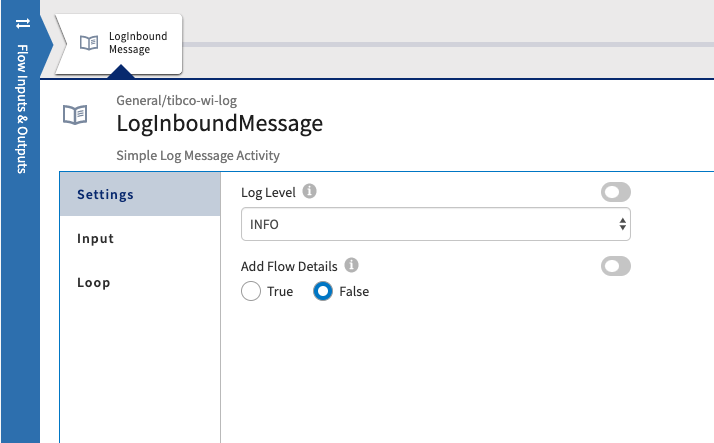

4. In the LHS panel of the LogMessage activity click 'Input' then click the 'a... * message' in the Activity input panel and enter the following in the message field:

```code
coerce.toString($flow.message)
```

> coerse.toString() function allows us to convert a JSON object to a string.

5. Close the Log activity.
6. Add a Parse JSON Activity after the previous Log activity. 
7. Click the 'ParseJSONActivity' activity title field and rename to 'ParsePayload'.
8. In the Input panel, map the jsonString of the Activity Input to '$flow.message.payload'.
9. Click 'Output Settings' in LHS panel and enter the following JSON in to the Schema:

```json
{ 
    "payload" : {
        "order_id": "",
        "customer_id" : "",
        "email" : "",
        "amount" : ""
    }
}
```
> We will parse the contents of the payload field string in to a JSON object.

10. Close the Parse JSON activity.
11. Add a Mapper Activity after the previous Parse JSON activity. 
12. Click the 'Mapper' activity title field and rename to 'MapperStringify'.
13. In the 'Input Settings' enter the following JSON in to the Input Schema:

```json
{
	"stringify":""
}
```

14. In the Input panel, enter the follow expression in to the stringify field

```code
string.trim(string.concat("{ \"payload\" : { \"order_id\" : \"",$activity[ParsePayload].jsonObject.payload.order_id,"\", \"customer_id\" : \"",$activity[ParsePayload].jsonObject.payload.customer_id,"\", \"status\" : \"SUCCESS\" }}"))
```

15. Close the Mapper activity.
16. Add a TCM Message Publisher Activity after the previous Mapper activity. 
17. In Settings panel, select the TCM Connection.
18. In the 'Input Settings' enter the following JSON in to the Input Schema:

```json
{
	"payload":""
}
```
19. In the Input panel, enter the following expression in to the destination field:

```code
"paymentexecuted"
```

20. Map the 'stringify' field from the MapperStringify activity to the Activity Input of the message payload

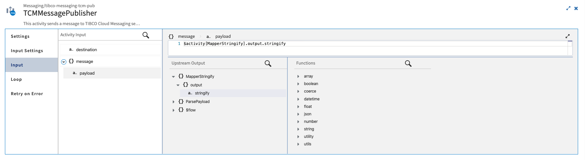

21. Close the Message Publisher activity.
22. Click 'Push App'.

### 5.2.2 Create Stock Microservice


1. Click 'Create' button.
2. Enter 'StockService' for the app name.
3. Click 'Create' button.
4. Click 'Create a TIBCO Flogo App'.
5. Click '+ Create' to create Flogo Flow.
6. Enter 'PrepareOrderFlow' for the Flow Name and click 'Create' button.


----

#### Trigger Logic


1. Click 'Start with a trigger'.
2. Click 'Message Subscriber' trigger.
3. Use the Connection dropdown box and choose the TCM Connector you created earlier and click 'Continue' button.
4. Click 'Just add the trigger' button
5. Click the TCM trigger symbol
6. Enter 'prepare' in to the Destination field.
7. Click 'Output Settings' in LHS panel and enter the following JSON in to the Message Schema

```json
{
    "payload": ""
}
```

8. Click the sync flow input and output symbol in the top right corner of the dialog box
9. Click 'Map to Flow Inputs' in LHS panel. We need to map the Flow Input to the Trigger Output. In the Flow Input pane navigate using the arrows to the payload field (message->payload). In The Trigger Output panel navigate using the arrows to the payload field ($trigger->message->payload). Click the 'payload' field. 
10. Close the Message Subscriber dialog box.

----

#### Flow Logic


1. Hover over the Activity Line, and click the first free box to add activity. The Add Activity dialog will be show.
2. In the LHS panel, scroll to 'General' and click. The activities panel will show you the general activities available to place at this step. Go ahead and click 'Log Message'. Click the 'LogMessage' activity title field and rename to 'LogInboundMessage'
3. In the LHS panel of the LogMessage activity click 'Input' then click the 'a... * message' in the Activity input panel and enter the following in the message field:

```code
coerce.toString($flow.message)
```

4. Close the Log activity.
5. Add a Parse JSON Activity after the previous Log activity. 
6. Click the 'ParseJSONActivity' activity title field and rename to 'ParsePayload'.
7. In the Input panel, map the jsonString of the Activity Input to '$flow.message.payload'.
8. Click 'Output Settings' in LHS panel and enter the following JSON in to the Schema:

```json
{
  "Order" : {
    "order_id" : "",
    "customer_id" : "",
    "email" : "",
    "items" : [ {
      "attributes" : {
        "Id" : "",
        "type" : ""
      },
      "item_name" : "",
      "price" : "",
      "quantity" : ""
    } ]
  }
}
```

9. Close the Parse JSON activity.
10. Add a Mapper Activity after the previous Parse JSON activity. 
11. Click the 'Mapper' activity title field and rename to 'MapperStringify'.
12. In the 'Input Settings' enter the following JSON in to the Input Schema:

```json
{
	"stringify":""
}
```

14. In the Input panel, enter the follow expression in to the stringify field

```code
string.trim(string.concat("{ \"payload\" : { \"order_id\" : \"",$activity[ParsePayload].jsonObject.Order.order_id,"\", \"customer_id\" : \"",$activity[ParsePayload].jsonObject.Order.customer_id,"\", \"status\" : \"SUCCESS\" }}"))
```

15. Close the Mapper activity.
16. Add a TCM Message Publisher Activity after the previous Mapper activity. 
17. In Settings panel, select the TCM Connection.
18. In the 'Input Settings' enter the following JSON in to the Input Schema:

```json
{
	"payload":""
}
```
19. In the Input panel, enter the following expression in to the destination field:

```code
"prepared"
```

20. Map the 'stringify' field from the MapperStringify activity to the Activity Input of the message payload
21. Close the Message Publisher activity.
22. Click 'Push App'.

### 5.2.3 Create Delivery Microservice


1. Click 'Create' button.
2. Enter 'DeliveryService' for the app name.
3. Click 'Create' button.
4. Click 'Create a TIBCO Flogo App'.
5. Click '+ Create' to create Flogo Flow.
6. Enter 'DeliverOrderFlow' for the Flow Name and click 'Create' button.


----

#### Trigger Logic


1. Click 'Start with a trigger'.
2. Click 'Message Subscriber' trigger.
3. Use the Connection dropdown box and choose the TCM Connector you created earlier and click 'Continue' button.
4. Click 'Just add the trigger' button
5. Click the TCM trigger symbol
6. Enter 'deliver' in to the Destination field.
7. Click 'Output Settings' in LHS panel and enter the following JSON in to the Message Schema

```json
{
    "payload": ""
}
```

8. Click the sync flow input and output symbol in the top right corner of the dialog box
9. Click 'Map to Flow Inputs' in LHS panel. We need to map the Flow Input to the Trigger Output. In the Flow Input pane navigate using the arrows to the payload field (message->payload). In The Trigger Output panel navigate using the arrows to the payload field ($trigger->message->payload). Click the 'payload' field. 
10. Close the Message Subscriber dialog box.

----

#### Flow Logic


1. Hover over the Activity Line, and click the first free box to add activity. The Add Activity dialog will be show.
2. In the LHS panel, scroll to 'General' and click. The activities panel will show you the general activities available to place at this step. Go ahead and click 'Log Message'. Click the 'LogMessage' activity title field and rename to 'LogInboundMessage'
3. In the LHS panel of the LogMessage activity click 'Input' then click the 'a... * message' in the Activity input panel and enter the following in the message field:

```code
coerce.toString($flow.message)
```

4. Close the Log activity.
5. Add a Parse JSON Activity after the previous Log activity. 
6. Click the 'ParseJSONActivity' activity title field and rename to 'ParsePayload'.
7. In the Input panel, map the jsonString of the Activity Input to '$flow.message.payload'.
8. Click 'Output Settings' in LHS panel and enter the following JSON in to the Schema:

```json
{
  "payload" : {
    "order_id" : "",
    "customer_id" : "",
    "email" : "",
    "ShippingAddress" : {
      "address1" : "",
      "address2" : "",
      "city" : "",
      "country" : "",
      "postcode" : ""
    }
  }
}
```

9. Close the Parse JSON activity.
10. Add a Mapper Activity after the previous Parse JSON activity. 
11. Click the 'Mapper' activity title field and rename to 'MapperStringify'.
12. In the 'Input Settings' enter the following JSON in to the Input Schema:

```json
{
	"stringify":""
}
```

14. In the Input panel, enter the follow expression in to the stringify field

```code
string.trim(string.concat("{ \"payload\" : { \"order_id\" : \"",$activity[ParsePayload].jsonObject.payload.order_id,"\", \"customer_id\" : \"",$activity[ParsePayload].jsonObject.payload.customer_id,"\", \"status\" : \"SUCCESS\" }}"))
```

15. Close the Mapper activity.
16. Add a TCM Message Publisher Activity after the previous Mapper activity. 
17. In Settings panel, select the TCM Connection.
18. In the 'Input Settings' enter the following JSON in to the Input Schema:

```json
{
	"payload":""
}
```
19. In the Input panel, enter the following expression in to the destination field:

```code
"delivered"
```

20. Map the 'stringify' field from the MapperStringify activity to the Activity Input of the message payload
21. Close the Message Publisher activity.
22. Click 'Push App'.

## 5.2 Start TIBCO Flogo Apps

Navigate to your apps [here](https://eu.integration.cloud.tibco.com/applications)


    
## 5.3 What's Next

[Testing your Solution](005.md)


