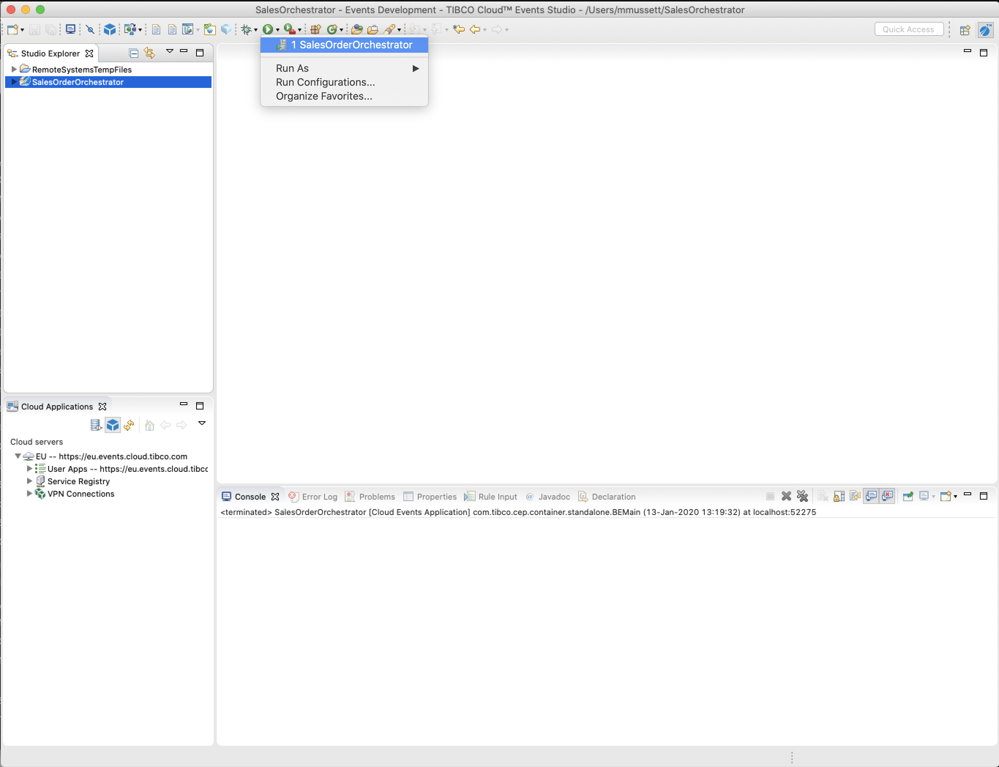
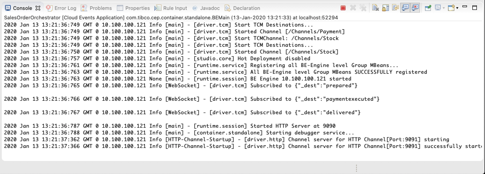
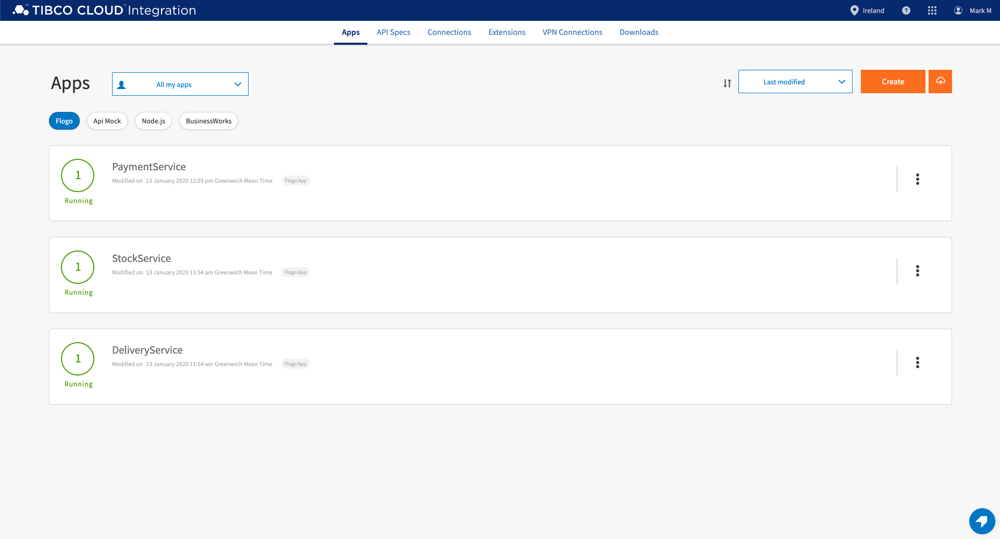
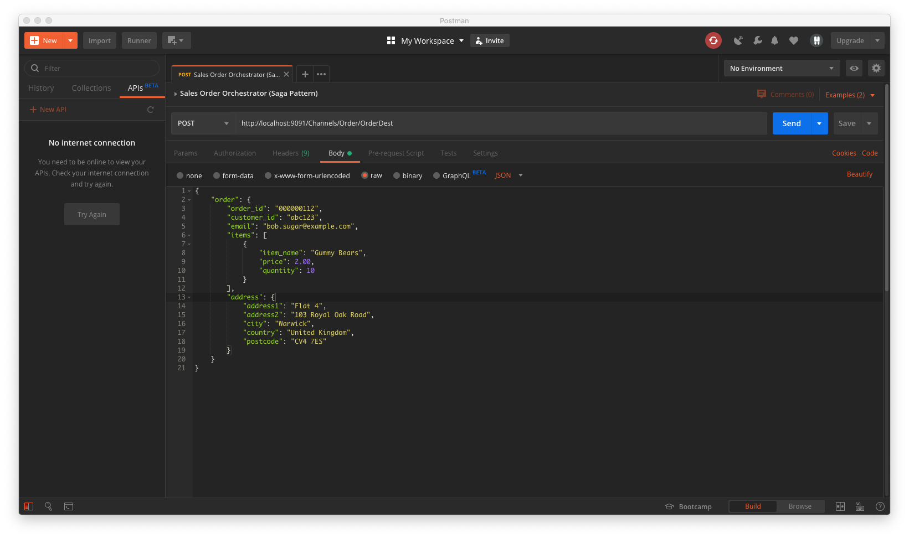
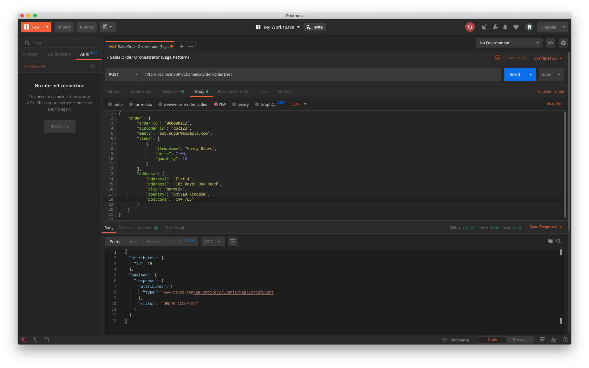

# 6.0 Testing your Solution

## 6.1 Start TIBCO Cloud Events

The Sales Order Orchestration can be ran locally within TIBCO Cloud Events Studio by launching the project using the Run option from the main application menu or via the Run Launcher on the toolbar.



Once the TIBCO Cloud Events application is running you should see the following in the Console output window:




# 6.2 Start Flogo Apps

Verify the 3 Flogo Applications are started by clicking [here](https://eu.integration.cloud.tibco.com/applications)




# 6.3 Send HTTP request using Postman

Once you have your solution running you can send an HTTP POST request to URL http://localhost:9091/Channels/Order/OrderDest with the following body

```json
{
    "order": {
        "order_id": "000000123",
        "customer_id": "abc123",
        "email": "bob.sugar@example.com",
        "items": [
            {
                "item_name": "Gummy Bears",
                "price": 2.00,
                "quantity": 10
            }
        ],
        "address": {
            "address1": "Flat 4",
            "address2": "103 Royal Oak Road",
            "city": "Warwick",
            "country": "United Kingdom",
            "postcode": "CV4 7ES"
        }
    }
}
```



TIBCO Cloud Events will respond with the following response:

```json
{
  "attributes": {
    "Id": 19
  },
  "payload": {
    "response": {
      "attributes": {
        "type": "www.tibco.com/be/ontology/Events/ReplyOrderEvent"
      },
      "status": "ORDER ACCEPTED"
    }
  }
}
```



Within TTIBCO Cloud™ Events Studio console you should see logging from the rules as events are received:

```code
2020 Jan 13 13:56:46:349 GMT 0 localhost Info [$default.be.mt$.Thread.8] - [user] [inference-class] >>>> Order PreProcessor fired
2020 Jan 13 13:56:46:351 GMT 0 localhost Info [$default.be.mt$.Thread.8] - [user] [inference-class] #### Order PreProcessor received Request with payload - {
  "order" : {
    "attributes" : {
      "type" : "www.tibco.com/be/ontology/Concepts/Order"
    },
    "order_id" : "000000112",
    "customer_id" : "abc123",
    "email" : "bob.sugar@example.com",
    "items" : [ {
      "item_name" : "Gummy Bears",
      "price" : "2.0",
      "quantity" : "10"
    } ],
    "address" : {
      "address1" : "Flat 4",
      "address2" : "103 Royal Oak Road",
      "city" : "Warwick",
      "country" : "United Kingdom",
      "postcode" : "CV4 7ES"
    }
  }
}
2020 Jan 13 13:56:46:354 GMT 0 localhost Info [$default.be.mt$.Thread.8] - [user] [inference-class] Order Id - 000000112
2020 Jan 13 13:56:46:354 GMT 0 localhost Info [$default.be.mt$.Thread.8] - [user] [inference-class] >>>> OrderRule.rule - Order Rule fired
2020 Jan 13 13:56:46:355 GMT 0 localhost Info [$default.be.mt$.Thread.8] - [user] [inference-class] #### OrderRule.rule - Order processed: 000000112 Customer:abc123
2020 Jan 13 13:56:46:355 GMT 0 localhost Info [$default.be.mt$.Thread.8] - [user] [inference-class] #### OrderRule.rule - Gummy Bears - £2.0 (X 10)
2020 Jan 13 13:56:46:355 GMT 0 localhost Info [$default.be.mt$.Thread.8] - [user] [inference-class] #### OrderRule.rule - Order Value £20.0
2020 Jan 13 13:56:46:358 GMT 0 localhost Info [$default.be.mt$.Thread.8] - [localhost] [inference-class] Sent Event be.gen.Events.PaymentEvent@id=42@extId=000000112 to channel com.tibco.cep.driver.tcm.TCMChannel@3d429511
2020 Jan 13 13:56:46:381 GMT 0 localhost Info [$default.be.mt$.Thread.2] - [user] [inference-class] >>>> PaymentExecuteRule.rule - Payment Executed Rule fired
2020 Jan 13 13:56:46:382 GMT 0 localhost Info [$default.be.mt$.Thread.2] - [user] [inference-class] #### PaymentExecuteRule.rule - Received Payment Executed Event with payload - {
  "payload" : {
    "attributes" : {
      "type" : "www.tibco.com/be/ontology/Events/PaymentExecutedEvent"
    },
    "order_id" : "000000112",
    "customer_id" : "abc123",
    "status" : "SUCCESS"
  }
}
2020 Jan 13 13:56:46:382 GMT 0 localhost Info [$default.be.mt$.Thread.2] - [user] [inference-class] #### PaymentExecuteRule.rule - ORDER 000000112 PAYMENT STATUS = SUCCESS
2020 Jan 13 13:56:46:382 GMT 0 localhost Info [$default.be.mt$.Thread.2] - [user] [inference-class] #### PaymentExecuteRule.rule - Payment approved for Order #000000112
2020 Jan 13 13:56:46:382 GMT 0 localhost Info [$default.be.mt$.Thread.2] - [user] [inference-class] #### ORDER STATE = null
2020 Jan 13 13:56:46:384 GMT 0 localhost Info [$default.be.mt$.Thread.2] - [localhost] [inference-class] Sent Event be.gen.Events.PrepareOrderEvent@id=44@extId=000000112 to channel com.tibco.cep.driver.tcm.TCMChannel@21404e6b
2020 Jan 13 13:56:46:424 GMT 0 localhost Info [$default.be.mt$.Thread.10] - [user] [inference-class] >>>> OrderPreparedRule.rule - Order Prepared Rule fired
2020 Jan 13 13:56:46:425 GMT 0 localhost Info [$default.be.mt$.Thread.10] - [user] [inference-class] #### OrderPreparedRule.rule - Received Order Prepared Event with payload - {
  "payload" : {
    "attributes" : {
      "type" : "www.tibco.com/be/ontology/Events/OrderPreparedEvent"
    },
    "order_id" : "000000112",
    "customer_id" : "abc123",
    "status" : "SUCCESS"
  }
}
2020 Jan 13 13:56:46:425 GMT 0 localhost Info [$default.be.mt$.Thread.10] - [user] [inference-class] #### OrderPreparedRule.rule - ORDER 000000112 PREPARED STATUS = SUCCESS
2020 Jan 13 13:56:46:425 GMT 0 localhost Info [$default.be.mt$.Thread.10] - [user] [inference-class] #### ORDER STATE = PENDING_PREPARE
2020 Jan 13 13:56:46:427 GMT 0 localhost Info [$default.be.mt$.Thread.10] - [localhost] [inference-class] Sent Event be.gen.Events.DeliverOrderEvent@id=46 to channel com.tibco.cep.driver.tcm.TCMChannel@7e4cc9b1
2020 Jan 13 13:56:46:449 GMT 0 localhost Info [$default.be.mt$.Thread.5] - [user] [inference-class] >>>> OrderDeliveredRule.rule - Order Delivered Rule fired
2020 Jan 13 13:56:46:450 GMT 0 localhost Info [$default.be.mt$.Thread.5] - [user] [inference-class] #### OrderDeliveredRule.rule - Received Order Delivered Event with payload - {
  "payload" : {
    "attributes" : {
      "type" : "www.tibco.com/be/ontology/Events/OrderDeliveredEvent"
    },
    "order_id" : "000000112",
    "customer_id" : "abc123",
    "status" : "SUCCESS"
  }
}
2020 Jan 13 13:56:46:450 GMT 0 localhost Info [$default.be.mt$.Thread.5] - [user] [inference-class] #### OrderDeliveredRule.rule - ORDER 000000112 DELIVERY STATUS = SUCCESS
2020 Jan 13 13:56:46:450 GMT 0 localhost Info [$default.be.mt$.Thread.5] - [user] [inference-class] #### ORDER STATE = COMPLETED
```

