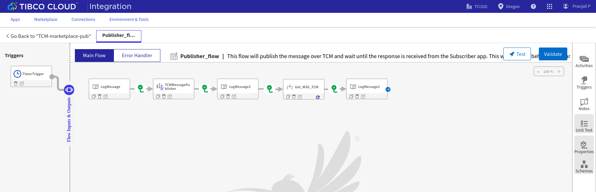

# Get TCM Message

## Prerequisites
- TIBCO Cloud™ Integration
- TIBCO Cloud™ Messaging - latest version. 

## Overview
This application demonstrates the behavior of Get JMS Message - typically used to fetch a message from JMS destination. Currently, there is no such activity within the TCM connector. The flow leverages TCM REST APIs to fetch messages from a TCM durable and REST Invoke TCI (Flogo) activity to mimic a similar behavior. 

The design executes (i.e., requests messages from TCM durable) the REST Invoke activity until it receives message(s) from a specified durable. Ensure the responses are configured properly to avoid the jobs timing out. 

Further details about the eFTL REST APIs (in TCM) can be found [here in the documentation.](https://messaging.cloud.tibco.com/docs/getstarted/quickstart-eftl/restapi-eftl.html) 

## Steps to use the Flogo application: 
1. Download the Flogo application (JSON file) from [here.](https://github.com/TIBCOSoftware/tci-flogo/tree/master/samples/app-dev/TCM/HowTo-Get_TCM_MSG)
2. Login to TIBCO Cloud™ Integration with a valid subscription.
3. Steps to import the Flogo application (from step #1) is listed [here.](https://github.com/TIBCOSoftware/tci-flogo/blob/master/samples/app-dev/readme.md)
4. Users need a valid subscription to TIBCO Cloud Messaging to configure the TIBCO Cloud Messaging Connector appropriately.
5. Note: Only standard durables (and not dynamic durables) are supported with this application. 
6. Publisher flow looks like shown below. Import the Subscriber app also from step #1.
7. For any additional information, please raise your queries or issues via the Issues section.

