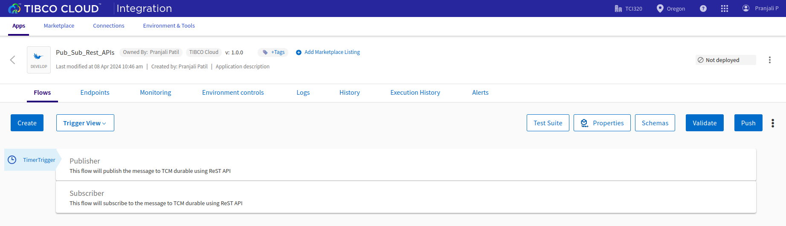

# Integrate TCI & TCM via REST API

## Prerequisites
- TIBCO Cloud™ Integration
- TIBCO Cloud™ Messaging - latest version. 

## Overview
This application demonstrates an easy way to integrate TCI (Flogo) and TCM (eFTL) using the REST APIs for any publisher and subscriber messaging patterns. This is an alternate solution to using the OOTB connector solution listed [here.](https://github.com/TIBCOSoftware/tci-flogo/blob/master/samples/app-dev/TCM/TCM_Pub_Sub_UsingConnector/Readme.md)

The application has two flows - Publisher and Subscriber. 

Both the flows (in TCI) use the Timer trigger to initiate the process. Invoke REST API activity in Flogo (TCI) leverages the REST APIs exposed by TCM to publish and subscribe via the TCM durable(s)/destination(s). These flows are easily extendable and customizable as per the business requirements. 

Further details about the eFTL REST APIs (in TCM) can be found [here in the documentation.](https://messaging.cloud.tibco.com/docs/getstarted/quickstart-eftl/restapi-eftl.html)

## Steps to use the Flogo application: 
1. Download the Flogo application (JSON file) from [here](https://github.com/TIBCOSoftware/tci-flogo/blob/master/samples/app-dev/TCM/TCM_Pub_Sub_UsingReSTAPI/TCM_Pub_usingReSTAPI.json)
2. Login to TIBCO Cloud™ Integration with a valid subscription.
3. Steps to import the Flogo application (from step #1) is listed [here](https://github.com/TIBCOSoftware/tci-flogo/blob/master/samples/app-dev/readme.md)
4. The imported Flogo app should look like shown below. 
5. Users don't need an explicit TIBCO Cloud Messaging Connector configured in this solution but will need a valid subscription to TIBCO Cloud Messaging to configure the Invoke REST API activity (in Flogo) appropriately. 
6. For any additional information, please raise your queries or issues via the Issues section.

